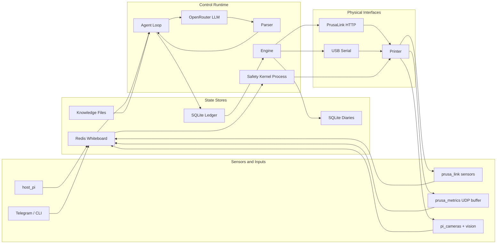
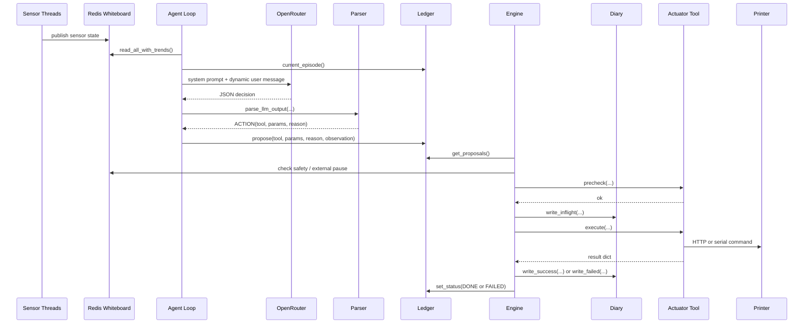
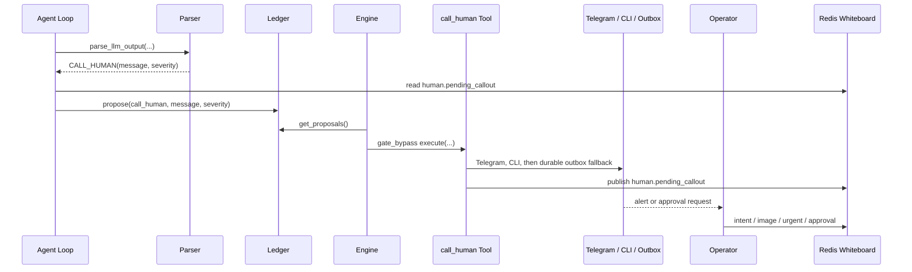
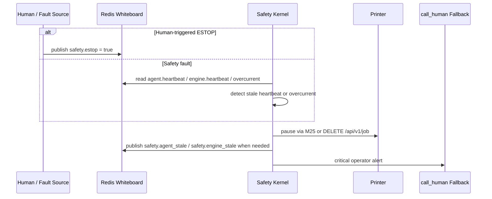
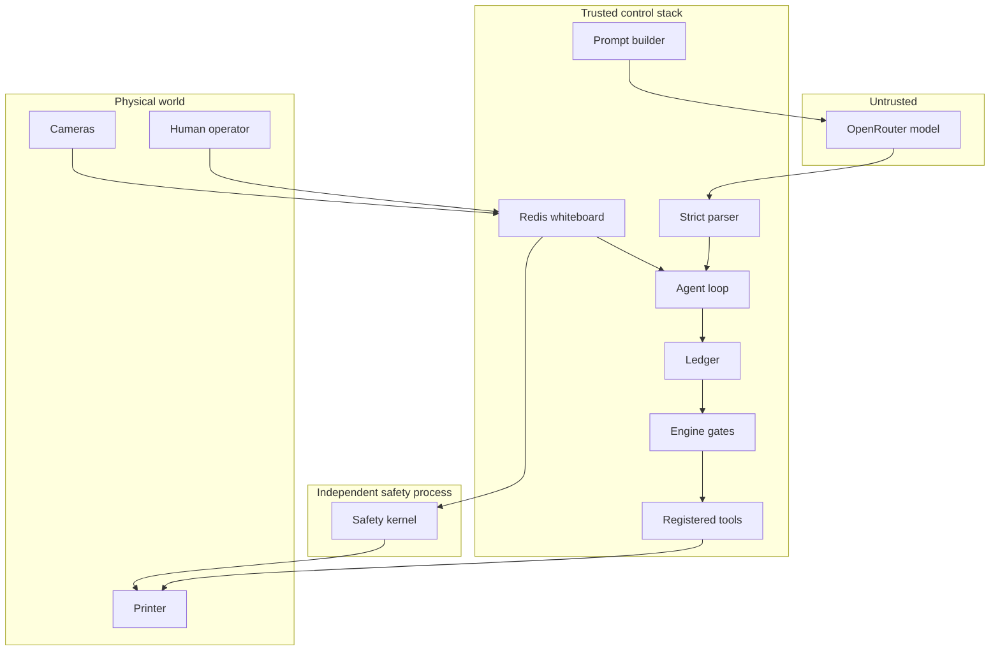

# Wallee Architecture Reference

Date: 2026-03-21

This document describes the current repository state in `v5` after the audit cleanup pass. It is grounded in the live code paths under `wallee/`, not just the design intent.

## Overview

Wallee is a multi-process control stack built around four persistent state planes:

- Redis whiteboard for live state, TTL-backed control keys, and sensor history rings.
- SQLite ledger for durable proposals, approvals, events, and current episode reconstruction.
- SQLite diaries for per-device-group execution idempotency and crash recovery.
- Knowledge files on disk for identity, heuristics, and accumulated observations.

The runtime currently starts one main Python process plus an independent safety-kernel subprocess. Inside the main process, the engine, sensors, agent, dashboard, Telegram bot, and optional CLI run concurrently.

## Complete Data Flow

### Boot flow

1. `wallee.main` loads `.env` and environment variables through `wallee.config.load_config()`.
2. It validates the OpenRouter API key and configures parser intervals, observation paths, web-search settings, and the vision model.
3. It ensures the data directory exists, falling back to `~/.wallee/data` if the requested path is not writable.
4. It connects the Redis whiteboard client.
5. It starts the safety kernel as a subprocess by invoking `python -m wallee.safety.kernel_main`.
6. It opens the ledger, applies migrations, and runs one reconcile pass for previously dispatched actions.
7. It loads built-in tools, then loads the configured device packs into the tool registry.
8. It starts the engine thread.
9. It creates the agent loop and passes it the registry, ledger, whiteboard, config, and knowledge paths.
10. It starts all sensor publisher threads with the agent wake callback wired in.
11. It starts the agent thread.
12. It starts the dashboard server.
13. If Telegram is configured, it starts the Telegram bot and injects its sender into the `call_human` tool.
14. If a TTY is attached, it starts the CLI loop; otherwise it stays headless.

### Observation flow

1. Device-pack sensors run on their own schedules.
2. Each sensor returns a dict of whiteboard keys.
3. `ToolRegistry._sensor_loop()` filters out `error` entries and publishes the remaining payload atomically with `Whiteboard.publish_many()`.
4. The whiteboard stores current values as JSON-encoded Redis strings and, when `history_depth > 0`, also maintains `:history` and `:history_ts` lists.
5. The agent reads a full snapshot with `read_all_with_trends()`, which injects `key:trend` annotations for numeric histories.

### Decision flow

1. The agent builds a cached system prompt from `SOUL.md`, `LEARNED.md`, `OBSERVATIONS.md`, the actuator tool list, and `JOB_CONTEXT.md` when present.
2. It builds a dynamic user message from phase, vision summary, external changes, whiteboard state, human intent, recent actions, and timestamp.
3. It calls OpenRouter with a strict JSON schema and prompt caching enabled on the system message.
4. The parser validates the LLM output and turns malformed responses into safe `WAIT` decisions.
5. The agent applies cooldown, oscillation, and stale-world guards.
6. For `ACTION` and `ACTION_CHAIN`, it writes durable proposals to the ledger.
7. For `WAIT`, it records a wait event and sleeps.
8. For `CALL_HUMAN`, it proposes the built-in `call_human` actuator through the ledger so the engine owns the side effect.

### Execution flow

1. The engine polls `PROPOSED` and `WAITING_APPROVAL` actions every `0.5s`.
2. Hardware proposals go through the gate sequence described below.
3. The engine writes an in-flight diary row before dispatching any hardware actuator.
4. Tool results are persisted both to the diary and to the ledger as `DONE` or `FAILED`.
5. The dashboard and human interfaces read the whiteboard and recent ledger state to show outcomes back to the operator.

## Data Flow Diagram

## Sequence Diagrams

### Typical `ACTION` cycle

### `CALL_HUMAN` cycle

### ESTOP event

## Engine Gate Sequence

Hardware actuators pass through the following path in `wallee/engine/dispatch.py`:

| Stage | Check | On failure |
|---|---|---|
| Tool lookup | Registered tool exists | `REJECTED` |
| Gate bypass | Built-in non-hardware tools skip the remaining hardware path | Immediate execute |
| Chain predecessor | Earlier chain steps must be successful | `SKIPPED` or `REJECTED` |
| Safety interlock | `safety.estop` must be clear; `resume_print` also checks `agent.external_pause` | `REJECTED` |
| Queue guard | No other in-flight action in the same device group | `SKIPPED` |
| Deadline | Proposal age must be under `max_proposal_age_ms` | `REJECTED` |
| Approval | Required operator approval must exist and be positive | `WAITING_APPROVAL` or `REJECTED` |
| TOCTOU | Side-effect-free precheck must still pass | `REJECTED` |
| Dispatch | Write diary, execute tool, persist result | `DONE` or `FAILED` |

The engine also runs a periodic reconcile every 60 seconds and a boot-time reconcile during startup.

## Tool Registry

Current runtime registration totals: `39` tools, of which `19` are sensors and `20` are actuators.

| Tool | Pack | Kind | Interface | Approval | Gate bypass | State effects | Params |
|---|---|---|---|---:|---:|---|---|
| `call_human` | builtin | actuator | Telegram / CLI / durable outbox | no | yes | — | `message=''`, `severity='info'` |
| `discover_hardware` | builtin | actuator | local discovery, filesystem, Redis | no | yes | — | — |
| `get_sensor_history` | builtin | actuator | Redis history lists | no | yes | — | `key=''`, `depth=30` |
| `lookup_issue` | builtin | actuator | local `REFERENCE.md` search | no | yes | — | `query=''` |
| `remember` | builtin | actuator | `OBSERVATIONS.md` append | no | yes | — | `observation=''` |
| `web_search` | builtin | actuator | OpenRouter web plugin | no | yes | — | `query=''` |
| `cancel_print` | prusa_link | actuator | PrusaLink HTTP + fallback G-code | yes | no | `printer.state`, `printer.job_state` | — |
| `disable_motors` | prusa_link | actuator | PrusaLink G-code | no | no | — | — |
| `extrude` | prusa_link | actuator | PrusaLink G-code | no | no | — | `length_mm=None`, `feedrate=300` |
| `home_axes` | prusa_link | actuator | PrusaLink G-code | no | no | — | — |
| `pause_print` | prusa_link | actuator | PrusaLink G-code | no | no | `printer.state`, `printer.job_state` | — |
| `resume_print` | prusa_link | actuator | PrusaLink G-code | no | no | `printer.state`, `printer.job_state` | — |
| `retract` | prusa_link | actuator | PrusaLink G-code | no | no | — | `length_mm=None`, `feedrate=300` |
| `set_flow_factor` | prusa_link | actuator | PrusaLink G-code | no | no | `printer.flow` | `percent=None` |
| `set_position` | prusa_link | actuator | PrusaLink G-code | no | no | — | `x=None`, `y=None`, `z=None` |
| `set_speed_factor` | prusa_link | actuator | PrusaLink G-code | no | no | `printer.speed` | `percent=None` |
| `set_temperature` | prusa_link | actuator | PrusaLink G-code | no | no | `printer.target_nozzle`, `printer.target_bed`, `printer.target_chamber` | `target=None`, `heater='nozzle'` |
| `start_print` | prusa_link | actuator | PrusaLink HTTP | yes | no | `printer.state`, `printer.job_state` | `file_path=''` |
| `read_endstops` | prusa_serial | actuator | USB serial (`M119`) | no | no | — | — |
| `send_gcode` | prusa_serial | actuator | USB serial allowlist | no | no | — | `command=''` |
| `read_cpu_temp` | host_pi | sensor | sysfs / psutil | — | — | — | — |
| `read_network_interfaces` | host_pi | sensor | psutil | — | — | — | — |
| `read_system_stats` | host_pi | sensor | psutil | — | — | — | — |
| `read_usb_devices` | host_pi | sensor | sysfs / `lsusb` / `system_profiler` | — | — | — | — |
| `read_buddy_cameras` | pi_cameras | sensor | RTSP via `ffmpeg` | — | — | — | — |
| `read_nozzle_camera` | pi_cameras | sensor | local HTTP snapshot | — | — | — | — |
| `read_vision_analysis` | pi_cameras | sensor | OpenRouter multimodal | — | — | — | — |
| `read_file_list` | prusa_link | sensor | PrusaLink HTTP | — | — | — | — |
| `read_job_phase` | prusa_link | sensor | PrusaLink HTTP | — | — | — | — |
| `read_printer_info` | prusa_link | sensor | PrusaLink HTTP | — | — | — | — |
| `read_printer_state` | prusa_link | sensor | PrusaLink HTTP | — | — | — | — |
| `read_electrical` | prusa_metrics | sensor | UDP metrics buffer | — | — | — | — |
| `read_enclosure` | prusa_metrics | sensor | UDP metrics buffer | — | — | — | — |
| `read_fans` | prusa_metrics | sensor | UDP metrics buffer | — | — | — | — |
| `read_filament` | prusa_metrics | sensor | UDP metrics buffer | — | — | — | — |
| `read_firmware_health` | prusa_metrics | sensor | UDP metrics buffer | — | — | — | — |
| `read_position` | prusa_metrics | sensor | UDP metrics buffer | — | — | — | — |
| `read_print_state` | prusa_metrics | sensor | UDP metrics buffer | — | — | — | — |
| `read_temperatures` | prusa_metrics | sensor | UDP metrics buffer | — | — | — | — |

## Sensor Inventory

| Sensor | Pack | Refresh | History depth | Published keys |
|---|---|---:|---:|---|
| `read_cpu_temp` | host_pi | `1.0 Hz` | `10` | `host.cpu_temp` |
| `read_system_stats` | host_pi | `0.5 Hz` | `10` | `host.cpu_percent`, `host.memory_percent`, `host.disk_percent`, `host.uptime_hours` |
| `read_usb_devices` | host_pi | `0.1 Hz` | `0` | `host.usb_devices` |
| `read_network_interfaces` | host_pi | `0.2 Hz` | `0` | `host.network_interfaces` |
| `read_printer_state` | prusa_link | `0.5 Hz` | `0` | `printer.state`, `printer.temp_nozzle`, `printer.target_nozzle`, `printer.temp_bed`, `printer.target_bed`, `printer.speed`, `printer.flow`, `printer.job_state`, `printer.job_progress`, `printer.job_time_remaining_s`, `printer.job_time_printing_s` |
| `read_printer_info` | prusa_link | `0.1 Hz` | `0` | `printer.firmware`, `printer.model`, `printer.serial`, `printer.nozzle_diameter` |
| `read_file_list` | prusa_link | `0.02 Hz` | `0` | `printer.files` |
| `read_job_phase` | prusa_link | `1.0 Hz` | `10` | `job.phase`, `job.phase_detail`, `job.time_in_phase_s` |
| `read_temperatures` | prusa_metrics | `0.3 Hz` | `30` | `printer.temp_nozzle`, `printer.target_nozzle`, `printer.temp_bed`, `printer.target_bed`, `printer.temp_chamber`, `printer.temp_heatbreak`, `printer.temp_board`, `printer.temp_mcu` |
| `read_electrical` | prusa_metrics | `0.3 Hz` | `30` | `printer.volt_bed`, `printer.volt_nozzle`, `printer.curr_nozzle`, `printer.oc_nozzle`, `printer.oc_input` |
| `read_fans` | prusa_metrics | `0.5 Hz` | `10` | `printer.fan_heatbreak_state`, `printer.fan_heatbreak_pwm`, `printer.fan_heatbreak_rpm`, `printer.fan_print_state`, `printer.fan_print_pwm`, `printer.fan_print_rpm`, `printer.xbe_fan_1_pwm`, `printer.xbe_fan_1_rpm`, `printer.xbe_fan_2_pwm`, `printer.xbe_fan_2_rpm`, `printer.xbe_fan_3_pwm`, `printer.xbe_fan_3_rpm` |
| `read_position` | prusa_metrics | `5.0 Hz` | `10` | `printer.pos_x`, `printer.pos_y`, `printer.pos_z`, `printer.ipos_x`, `printer.ipos_y`, `printer.ipos_z` |
| `read_filament` | prusa_metrics | `1.0 Hz` | `10` | `printer.fsensor_state`, `printer.fsensor_flow`, `printer.fsensor_rotation`, `printer.fsensor_rotation_inc` |
| `read_enclosure` | prusa_metrics | `0.3 Hz` | `5` | `printer.door_sensor`, `printer.temp_chamber` |
| `read_firmware_health` | prusa_metrics | `0.2 Hz` | `5` | `printer.heap_free`, `printer.heap_total`, `printer.cpu_usage`, `printer.stepper_stall` |
| `read_print_state` | prusa_metrics | `0.3 Hz` | `0` | `printer.is_printing`, `printer.print_filename`, `printer.heater_enabled`, `printer.pwm_nozzle`, `printer.pwm_bed` |
| `read_nozzle_camera` | pi_cameras | `1.0 Hz` | `3` | `camera.nozzle_frame`, `camera.nozzle_frame_size`, `camera.nozzle_status`, `camera.nozzle_port` |
| `read_buddy_cameras` | pi_cameras | `0.1 Hz` | `3` | `camera.buddy_count`, `camera.buddy1_frame`, `camera.buddy1_frame_size`, `camera.buddy1_status`, `camera.buddy1_ip`, `camera.buddy2_frame`, `camera.buddy2_frame_size`, `camera.buddy2_status`, `camera.buddy2_ip`, `camera.buddy3_status` |
| `read_vision_analysis` | pi_cameras | `0.1 Hz` | `5` | `vision.nozzle.*`, `vision.buddy.*`, `vision.buddy2.*`, `vision.status`, `vision.confidence`, `vision.last_analysis_ts` |

### Device-pack interfaces

- `host_pi`: local filesystem, `psutil`, and shell fallbacks.
- `prusa_link`: HTTP to the printer's PrusaLink API.
- `prusa_metrics`: UDP push to the Pi on port `8514`, parsed into a shared `MetricsBuffer`.
- `prusa_serial`: USB serial at the detected ACM device.
- `pi_cameras`: local HTTP, RTSP via `ffmpeg`, local LAN discovery, and a multimodal OpenRouter call.

## Whiteboard Key Catalog

The whiteboard stores JSON values in Redis strings. Any sensor key with nonzero history depth also gets:

- `key:history` as a Redis list of the most recent JSON-encoded values.
- `key:history_ts` as a Redis list of the corresponding publish timestamps.

### Control and operator keys

| Key | Writer(s) | Reader(s) | Purpose |
|---|---|---|---|
| `agent.heartbeat` | agent heartbeat thread | safety kernel | agent liveness |
| `engine.heartbeat` | engine heartbeat thread | safety kernel | engine liveness |
| `agent.last_decision` | agent loop | dashboard, debugging | last parsed decision summary |
| `agent.cooldown` | agent loop | agent loop | temporary block on retrying a rejected tool |
| `agent.external_pause` | agent loop | engine, agent loop | blocks blind resume after non-agent pause |
| `agent.awaiting_feedback` | agent loop | agent loop | one-shot request for operator outcome feedback |
| `agent.missing_sensors` | agent loop | dashboard, debugging | sensor availability summary |
| `agent.activity_log` | agent loop | dashboard | recent human-readable activity lines |
| `human.intent` | Telegram, CLI | agent loop | current operator request |
| `human.image` | Telegram | agent loop | one-off human photo for the next cycle |
| `human.urgent` | Telegram, CLI | agent loop | urgency flag for the next cycle |
| `human.pending_callout` | `call_human` tool, agent loop | agent loop, Telegram, CLI | dedup and acknowledgement of active operator escalation |
| `human.intent_log` | Telegram | dashboard | recent operator messages |
| `print.queue` | Telegram, agent loop | agent loop, Telegram | queued filenames for automatic start when idle |
| `safety.estop` | Telegram, CLI | safety kernel, engine | emergency-stop flag |
| `safety.agent_stale` | safety kernel | dashboard, debugging | heartbeat fault indicator |
| `safety.engine_stale` | safety kernel | dashboard, debugging | heartbeat fault indicator |

### Discovery and camera keys

| Key | Writer(s) | Reader(s) | Purpose |
|---|---|---|---|
| `camera.nozzle_port` | nozzle camera sensor, `discover_hardware` | dashboard, debugging | detected `ustreamer` port |
| `camera.buddy_ips` | `discover_hardware` | dashboard, debugging | discovered buddy-camera IPs |
| `camera.buddy_count` | buddy camera sensor | dashboard | count of discovered buddy cameras |
| `camera.nozzle_frame` | nozzle camera sensor | dashboard, vision analysis | base64 JPEG |
| `camera.nozzle_frame_size` | nozzle camera sensor | dashboard | image size |
| `camera.nozzle_status` | nozzle camera sensor | dashboard, Telegram snapshot | `live`, `stale`, or `offline` |
| `camera.buddy1_frame` | buddy camera sensor | dashboard, vision analysis, Telegram snapshot | base64 JPEG |
| `camera.buddy1_frame_size` | buddy camera sensor | dashboard | image size |
| `camera.buddy1_status` | buddy camera sensor | dashboard, Telegram snapshot | `live`, `stale`, or `offline` |
| `camera.buddy1_ip` | buddy camera sensor | dashboard | discovered RTSP endpoint IP |
| `camera.buddy2_frame` | buddy camera sensor | dashboard, vision analysis, Telegram snapshot | base64 JPEG |
| `camera.buddy2_frame_size` | buddy camera sensor | dashboard | image size |
| `camera.buddy2_status` | buddy camera sensor | dashboard, Telegram snapshot | `live`, `stale`, or `offline` |
| `camera.buddy2_ip` | buddy camera sensor | dashboard | discovered RTSP endpoint IP |
| `camera.buddy3_status` | buddy camera sensor | dashboard | reserved offline slot |

### Vision keys

| Key pattern | Writer(s) | Reader(s) | Purpose |
|---|---|---|---|
| `vision.nozzle.normal` and defect scores | vision analysis sensor | agent prompt, dashboard | structured nozzle-camera scores |
| `vision.nozzle.status` | vision analysis sensor | agent loop, dashboard | `NORMAL`, `POSSIBLE:*`, `DEFECT:*` |
| `vision.buddy.*` | vision analysis sensor | agent prompt, dashboard | structured buddy-camera scores |
| `vision.buddy.status` | vision analysis sensor | dashboard | buddy-camera status |
| `vision.buddy2.*` | vision analysis sensor | agent prompt, dashboard | structured second buddy-camera scores |
| `vision.buddy2.status` | vision analysis sensor | dashboard | second buddy-camera status |
| `vision.status` | vision analysis sensor | agent loop, prompt, dashboard | combined worst-case print status |
| `vision.confidence` | vision analysis sensor | agent prompt, dashboard | primary combined confidence |
| `vision.last_analysis_ts` | vision analysis sensor | dashboard, debugging | liveness of multimodal analysis |

### Host keys

| Key | Writer(s) | Reader(s) | Purpose |
|---|---|---|---|
| `host.cpu_temp` | host sensor | prompt, dashboard | Pi thermal health |
| `host.cpu_percent` | host sensor | prompt, dashboard | host load |
| `host.memory_percent` | host sensor | prompt, dashboard | host memory pressure |
| `host.disk_percent` | host sensor | prompt, dashboard | disk pressure |
| `host.uptime_hours` | host sensor | prompt, dashboard | host uptime |
| `host.usb_devices` | host sensor | dashboard | local USB inventory |
| `host.network_interfaces` | host sensor | dashboard | LAN interfaces and IPs |

### Job and printer state keys

| Key | Writer(s) | Reader(s) | Purpose |
|---|---|---|---|
| `job.phase` | PrusaLink phase sensor | agent loop, prompt, vision analysis, dashboard | high-level phase |
| `job.phase_detail` | PrusaLink phase sensor | prompt, dashboard | human-readable phase detail |
| `job.time_in_phase_s` | PrusaLink phase sensor | prompt, dashboard | elapsed time in current phase |
| `printer.state` | PrusaLink status sensor | agent loop, engine, prompt, dashboard | printer machine state |
| `printer.job_state` | PrusaLink status sensor | prompt, dashboard, prechecks | job state |
| `printer.job_progress` | PrusaLink status sensor | dashboard | job percentage |
| `printer.job_time_remaining_s` | PrusaLink status sensor | dashboard | remaining time |
| `printer.job_time_printing_s` | PrusaLink status sensor | dashboard | elapsed print time |
| `printer.files` | PrusaLink file-list sensor | dashboard, agent auto-start | available files |
| `printer.firmware` | printer-info sensor | dashboard | firmware string |
| `printer.model` | printer-info sensor | dashboard | model/hostname |
| `printer.serial` | printer-info sensor | dashboard | serial number |
| `printer.nozzle_diameter` | printer-info sensor | dashboard | nozzle metadata |
| `printer.print_filename` | metrics sensor | prompt, dashboard | current file name |
| `printer.serial_port` | `discover_hardware` | dashboard | detected serial path |

### Thermal, electrical, motion, and print-process keys

| Key | Writer(s) | Reader(s) | Purpose |
|---|---|---|---|
| `printer.temp_nozzle` | PrusaLink, metrics | prompt, dashboard, prechecks | nozzle temperature |
| `printer.target_nozzle` | PrusaLink, metrics | prompt, dashboard, prechecks | nozzle target |
| `printer.temp_bed` | PrusaLink, metrics | prompt, dashboard | bed temperature |
| `printer.target_bed` | PrusaLink, metrics | prompt, dashboard | bed target |
| `printer.temp_chamber` | metrics | prompt, dashboard | chamber temperature |
| `printer.target_chamber` | actuator state effect target | prompt, dashboard | chamber target intent |
| `printer.temp_heatbreak` | metrics | prompt, dashboard | heatbreak temperature |
| `printer.temp_board` | metrics | dashboard | board temperature |
| `printer.temp_mcu` | metrics | dashboard | MCU temperature |
| `printer.speed` | PrusaLink sensor, `set_speed_factor` effect | prompt, dashboard | speed factor |
| `printer.flow` | PrusaLink sensor, `set_flow_factor` effect | prompt, dashboard | flow factor |
| `printer.volt_bed` | metrics | dashboard | bed voltage |
| `printer.volt_nozzle` | metrics | dashboard | nozzle voltage |
| `printer.curr_nozzle` | metrics | dashboard | nozzle current |
| `printer.oc_nozzle` | metrics | safety kernel, dashboard | nozzle overcurrent |
| `printer.oc_input` | metrics | safety kernel, dashboard | input overcurrent |
| `printer.fan_heatbreak_state` | metrics | dashboard | heatbreak fan state |
| `printer.fan_heatbreak_pwm` | metrics | dashboard | heatbreak fan PWM |
| `printer.fan_heatbreak_rpm` | metrics | dashboard | heatbreak fan RPM |
| `printer.fan_print_state` | metrics | dashboard | print fan state |
| `printer.fan_print_pwm` | metrics | dashboard | print fan PWM |
| `printer.fan_print_rpm` | metrics | dashboard | print fan RPM |
| `printer.xbe_fan_1_pwm` / `_rpm` | metrics | dashboard | enclosure fan 1 |
| `printer.xbe_fan_2_pwm` / `_rpm` | metrics | dashboard | enclosure fan 2 |
| `printer.xbe_fan_3_pwm` / `_rpm` | metrics | dashboard | enclosure fan 3 |
| `printer.pos_x`, `printer.pos_y`, `printer.pos_z` | metrics | dashboard | toolhead position |
| `printer.ipos_x`, `printer.ipos_y`, `printer.ipos_z` | metrics | dashboard | stepper positions |
| `printer.fsensor_state` | metrics | prompt, dashboard | filament sensor state |
| `printer.fsensor_flow` | metrics | prompt, dashboard | filament flow counter |
| `printer.fsensor_rotation` | metrics | dashboard | filament rotation |
| `printer.fsensor_rotation_inc` | metrics | dashboard | filament rotation increment |
| `printer.door_sensor` | metrics | dashboard | enclosure door |
| `printer.heap_free`, `printer.heap_total` | metrics | dashboard | firmware memory |
| `printer.cpu_usage` | metrics | dashboard | firmware CPU load |
| `printer.stepper_stall` | metrics | prompt, dashboard | stall counter |
| `printer.is_printing` | metrics | dashboard | coarse print flag |
| `printer.heater_enabled` | metrics | dashboard | heater enable state |
| `printer.pwm_nozzle` | metrics | dashboard | nozzle PWM |
| `printer.pwm_bed` | metrics | dashboard | bed PWM |
| `printer.api_error` | PrusaLink sensors | dashboard, debugging | last HTTP sensor error |

## Prompt and Token Budget

### Cached system prompt

The system prompt is built in this order:

1. `SOUL.md`
2. `LEARNED.md`
3. `OBSERVATIONS.md`
4. actuator tool inventory
5. `JOB_CONTEXT.md` if present
6. strict JSON output instructions

The system prompt is marked cacheable through OpenRouter `cache_control`.

### Dynamic user message

The user message is built in this order:

1. pending callout banner
2. phase banner
3. condensed vision summary from the highest nontrivial `vision.*` scores
4. external changes
5. whiteboard dump, excluding images and selected internal or verbose keys
6. human intent
7. recent episode actions
8. timestamp

### Measured budget estimate

Using the live prompt builder and current knowledge files on a representative active-print state:

| Segment | Words | Rough tokens (`words × 1.3`) | Characters | Rough tokens (`chars / 4`) |
|---|---:|---:|---:|---:|
| System prompt | `2107` | `~2739` | `15953` | `~3988` |
| Dynamic user message | `77` | `~100` | `698` | `~174` |
| Total | `2184` | `~2839` | `16651` | `~4163` |

The large swing between the two heuristics is normal for Markdown-heavy prompts. The important architectural point is that the steady-state prompt remains far below the size it would reach if `REFERENCE.md` were loaded inline.

## Latency Analysis

### Control-path timings from code

| Stage | Typical timing |
|---|---|
| Sensor publish cadence | `0.02 Hz` to `5.0 Hz` depending on tool |
| Agent wake on notable changes | immediate event for printer-state and filament-state changes |
| Agent default wait interval | `15 s` |
| Agent active min/max interval | `10 s` to `30 s` |
| Agent idle max interval | `120 s` |
| LLM timeout | `60 s` |
| Engine poll interval | `0.5 s` |
| Approval timeout | `300 s` |
| Vision analysis cadence | `0.1 Hz` with up to `15 s` multimodal timeout |

### End-to-end estimates

- Fast telemetry-triggered action:
  sensor publish -> wake event -> LLM call -> engine poll -> dispatch
  Practical range: about `1-3 s` plus external API latency.

- Typical routine printing cycle:
  whiteboard refresh -> scheduled agent cycle -> LLM call -> engine poll -> dispatch
  Practical range: about `10-30 s`.

- Vision-driven response:
  camera capture -> vision sensor run -> whiteboard publish -> next agent cycle -> LLM call -> engine poll
  Practical range: about `10-40 s`.

- Human approval path:
  proposal -> engine sets `WAITING_APPROVAL` -> Telegram/CLI notification -> operator response -> next engine poll
  Human-dependent; system-side overhead is sub-second outside messaging.

## Trust Boundary

### What the LLM can do

- Read everything the prompt builder includes from Redis and the knowledge files.
- Propose one `WAIT`, `ACTION`, `ACTION_CHAIN`, or `CALL_HUMAN` decision.
- Influence which registered actuator is proposed and with which parameters.

### What the LLM cannot do directly

- Dispatch hardware without a ledger proposal.
- Skip engine validation for hardware tools.
- Self-approve an action that requires operator approval.
- Write raw commands to PrusaLink or serial by itself.
- Override the safety kernel's ESTOP behavior.

### Important nuance

Some built-ins such as `call_human`, `lookup_issue`, `remember`, and `web_search` are marked `gate_bypass`, but they are still executed by the engine, not by the LLM or by the parser directly.

## Human Interface Paths

### Telegram

- Commands: `/start`, `/status`, `/urgent`, `/estop`, `/snapshot`, `/approve`, `/reject`, `/help`, `/queue`
- Supports photo upload into `human.image`
- Immediately acknowledges inbound text and photo messages
- Uses `_send_with_retry()` for outbound reliability

### CLI

- Commands: `intent`, `urgent`, `approve`, `reject`, `status`, `pending`, `history`, `estop`, `help`, `quit`
- Local only, no image path
- Shares the same whiteboard and ledger contracts as Telegram

### `call_human` fallback chain

1. Telegram sender if configured
2. CLI / TTY if available
3. Durable outbox file under the data directory

The durable outbox write is verified on disk before the tool reports success.

## Replay Harness

The replay harness under `wallee/testing/replay_harness.py` reuses the real prompt builder and parser. It loads the tool registry for prompt context, feeds scenario state into the prompt builder, calls OpenRouter, parses the output, and compares the resulting decision to scenario expectations.

Current scenario corpus: `60` JSON files across these categories:

- `01-08`: `normal_operation`
- `09-20`: `vision_defects`
- `21-26`: `ambiguous_vision`
- `27-35`: `telemetry_reasoning`
- `36-44`: `human_interaction`
- `45-50`: `rejection_learning`
- `51-57`: `edge_cases`
- `58-60`: `action_chains`

## Current Validation Snapshot

| Check | Result |
|---|---|
| Python tests | `518 passed in 36.45s` |
| Earlier architecture-verification run | `523 passed in 36.56s` |
| Lint | `ruff check wallee/` clean |
| Mermaid blocks in root docs | `6` |

## Limitations

- ESTOP is still software-mediated through PrusaLink, not a physical relay.
- Redis is a runtime dependency for the whiteboard and for safety monitoring.
- Vision analysis adds external LLM latency and is intentionally phase-gated.
- The current codebase is optimized around one printer installation rather than multi-printer orchestration.
