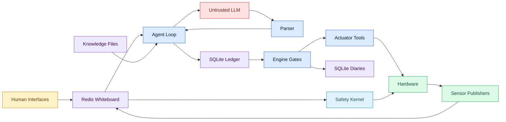
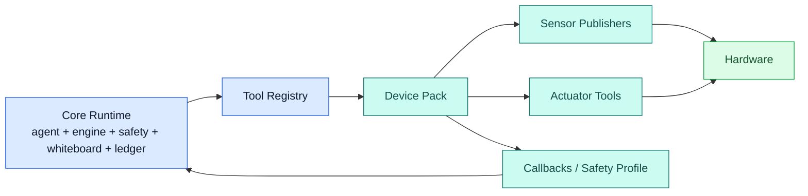
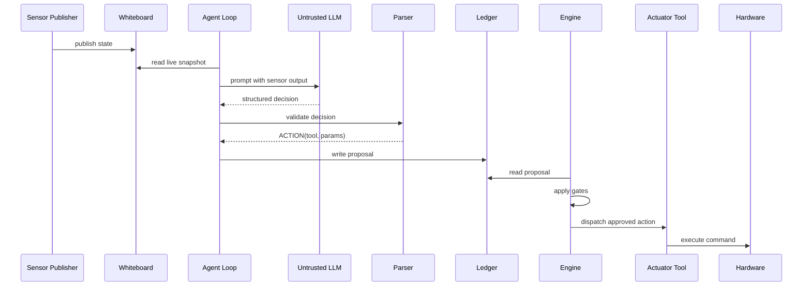
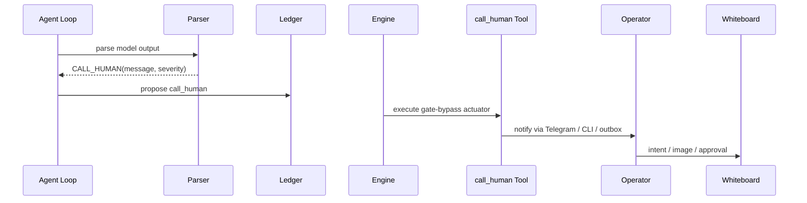
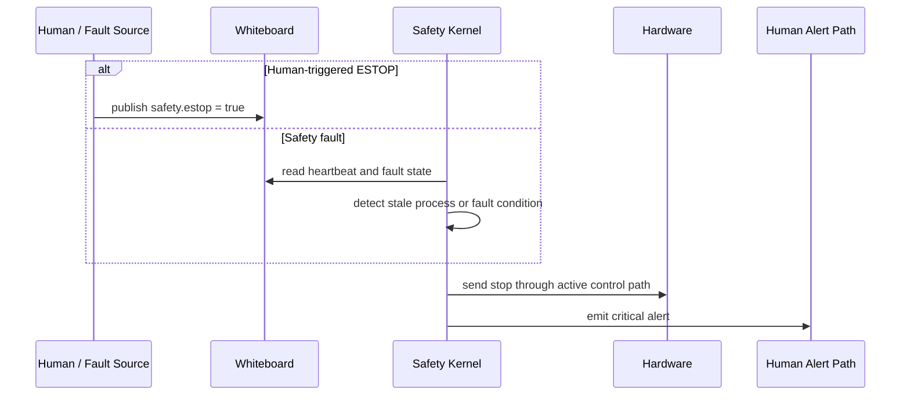
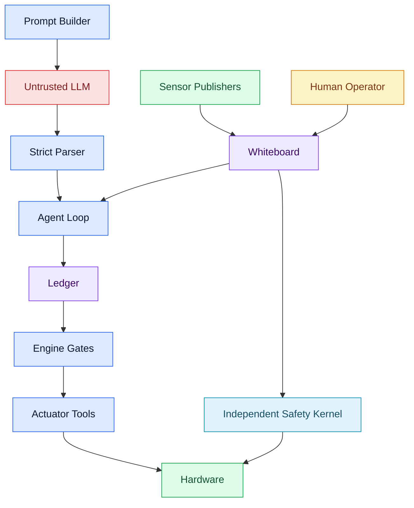

# Wallee Architecture Reference

> **Retired document.** This describes the v5 architecture line, now archived on the `legacy/v5` branch (see [`docs/internal/RETIRED_FINDINGS.md`](docs/internal/RETIRED_FINDINGS.md)). The current v6 architecture entry points are [`AGENTS.md`](AGENTS.md) and [`docs/internal/V6_TREE_README.md`](docs/internal/V6_TREE_README.md); a consolidated v6 architecture document is being written.

Date: 2026-03-21

Wallee is an architecture for safely letting LLMs operate physical hardware without trusting the model to execute directly. The core contribution is hardware-agnostic: the LLM is untrusted, deterministic code owns validation and dispatch, and device packs contain the hardware-specific tools, state conventions, and integration details.

## Overview

Wallee is built around four persistent state planes:

- Redis whiteboard for live state, TTL-backed control keys, and sensor history rings
- SQLite ledger for durable proposals, approvals, events, and episode reconstruction
- SQLite diaries for per-device-group execution idempotency and crash recovery
- Knowledge files on disk for identity, heuristics, and accumulated observations

The runtime starts one main Python process plus an independent safety-kernel subprocess. Inside the main process, the engine, sensor publishers, agent, dashboard, Telegram bot, and optional CLI run concurrently.

## Architecture Contribution

The central design claim is not that an LLM can control a specific machine. It is that an LLM can reason about physical systems inside a control stack that does not trust it.

That separation has three parts:

- The LLM proposes policy, but never executes directly
- The engine validates every actuator proposal before dispatch
- Device packs own all hardware-specific behavior, including sensor publishers, actuator tools, callbacks, and key conventions

If you replace the machine, the core architecture should not change. You replace the device pack.

## Complete Data Flow

### Boot flow

1. `wallee.main` loads configuration through `wallee.config.load_config()`.
2. It validates the OpenRouter key and configures parser intervals, knowledge paths, web-search settings, and the vision model.
3. It ensures the data directory exists, falling back to `~/.wallee/data` if the configured path is not writable.
4. It connects the Redis whiteboard client.
5. It starts the safety kernel as a subprocess by invoking `python -m wallee.safety.kernel_main`.
6. It opens the ledger, applies migrations, and runs one reconcile pass for previously dispatched actions.
7. It loads built-in tools and the configured device packs into the tool registry.
8. It starts the engine thread.
9. It creates the agent loop and passes it the registry, ledger, whiteboard, config, and knowledge paths.
10. It starts all background sensor publishers with the agent wake callback wired in.
11. It starts the agent thread.
12. It starts the dashboard server.
13. If Telegram is configured, it starts the Telegram bot and injects its sender into the `call_human` tool.
14. If a TTY is attached, it starts the CLI loop; otherwise it stays headless.

### Architecture flow

## Sensor Publishers vs Actuator Tools

The tool registry has two fundamentally different kinds of entries.

**Actuator tools** are actions the LLM can propose. They move through the trusted execution path:

`LLM decision -> Parser -> Ledger -> Engine -> Actuator Tool -> Hardware`

Actuator tools are:

- proposed by the LLM
- stored durably in the ledger
- validated by the engine
- optionally approval-gated
- dispatched to hardware only after deterministic checks pass

**Sensor publishers** are background functions that read from hardware on a schedule and publish state into the whiteboard. Their path is separate:

`Hardware -> Sensor Publisher -> Whiteboard -> Agent prompt`

Sensor publishers are:

- not called by the LLM
- started by the runtime, not by the agent
- responsible for reading hardware and publishing descriptive state
- the source of most of the live context the LLM sees

The LLM sees sensor output in its prompt. It proposes actuator tools in its response. Sensors run independently. The engine validates actuator proposals. That distinction is the core architecture.

Current runtime registration totals: 20 actuator tools the LLM can propose, plus 20 background sensor publishers.

## Sensor and Actuator Paths

```mermaid
%%{init: {'theme':'base','themeVariables': {
  'primaryColor':'#dbeafe',
  'primaryTextColor':'#0f172a',
  'primaryBorderColor':'#2563eb',
  'secondaryColor':'#dcfce7',
  'secondaryTextColor':'#14532d',
  'secondaryBorderColor':'#16a34a',
  'tertiaryColor':'#fef3c7',
  'tertiaryTextColor':'#78350f',
  'tertiaryBorderColor':'#d97706',
  'lineColor':'#475569',
  'fontSize':'14px'
}}%%
flowchart TB
    subgraph SENSOR_PATH["Sensor Path"]
        HW1["Hardware"] --> SP["Sensor Publisher"]
        SP --> WB1["Whiteboard"]
        WB1 --> PROMPT["Agent Prompt Context"]
    end

    subgraph ACT_PATH["Actuator Path"]
        LLM2["LLM Decision"] --> PARSE["Parser"]
        PARSE --> LEDGER2["Ledger Proposal"]
        LEDGER2 --> ENG2["Engine Gates"]
        ENG2 --> ACT2["Actuator Tool"]
        ACT2 --> HW2["Hardware"]
    end

    class HW1,HW2 hardware
    class SP,ACT2 devicepack
    class WB1,LEDGER2 state
    class PROMPT,PARSE,ENG2 trusted
    class LLM2 untrusted

    classDef hardware fill:#dcfce7,stroke:#16a34a,color:#14532d
    classDef devicepack fill:#ccfbf1,stroke:#0f766e,color:#134e4a
    classDef state fill:#ede9fe,stroke:#7c3aed,color:#3b0764
    classDef trusted fill:#dbeafe,stroke:#2563eb,color:#0f172a
    classDef untrusted fill:#fee2e2,stroke:#dc2626,color:#7f1d1d
```

## Device-Pack Extension Model

The device pack is the hardware boundary. That is where users create their own tools, adapt state names, and handle hardware-specific quirks.

A device pack can provide:

- sensor publishers that read the hardware and publish state
- actuator tools that the LLM may propose
- callbacks that enrich generic job context or inject pack-specific behavior
- safety-profile data that tells the independent safety kernel how to stop the active machine

The core remains generic by depending on contracts rather than on machine knowledge:

- sensor publishers return key-value payloads with refresh and history metadata
- actuator tools declare approval requirements, proposal age limits, and state effects
- device callbacks expose optional hooks without changing the agent or engine architecture

## Engine Gate Sequence

Hardware actuator proposals pass through the following path in `wallee/engine/dispatch.py`:

| Stage | Check | On failure |
|---|---|---|
| Tool lookup | Registered actuator exists | `REJECTED` |
| Gate bypass | Built-in non-hardware actuators skip the remaining hardware path | Immediate execute |
| Chain predecessor | Earlier chain steps must be successful | `SKIPPED` or `REJECTED` |
| Safety interlock | `safety.estop` must be clear; resume-style actions also check `agent.external_pause` | `REJECTED` |
| Queue guard | No other in-flight action in the same device group | `SKIPPED` |
| Deadline | Proposal age must be under `max_proposal_age_ms` | `REJECTED` |
| Approval | Required operator approval must exist and be positive | `WAITING_APPROVAL` or `REJECTED` |
| TOCTOU | Side-effect-free precheck must still pass | `REJECTED` |
| Dispatch | Write diary, execute tool, persist result | `DONE` or `FAILED` |

The engine also runs a periodic reconcile every 60 seconds and a boot-time reconcile during startup.

## Sequence Diagrams

### Typical `ACTION` cycle

### `CALL_HUMAN` cycle

### ESTOP event

## Whiteboard and State Ownership

The whiteboard is the shared live-state surface. The framework owns only a small set of generic namespaces:

- `agent.*` for liveness, cooldowns, and activity summaries
- `human.*` for operator intent, images, urgency, and pending callouts
- `safety.*` for ESTOP and stale-process indicators
- `job.*` for generic job metadata and phase when provided by a device pack

Everything else is device-pack territory. A pack chooses which state keys best describe its hardware, publishes them to the whiteboard, and declares actuator `state_effects` so the core can distinguish agent-caused changes from external ones.

That division is what keeps the core generic:

- the whiteboard is shared infrastructure
- key naming beyond the framework namespaces belongs to the device pack
- the agent reasons over whatever state the active pack publishes

## Prompt and Token Budget

### Cached system prompt

The system prompt is built in this order:

1. `SOUL.md`
2. `LEARNED.md`
3. `OBSERVATIONS.md`
4. actuator-tool inventory
5. `JOB_CONTEXT.md` if present
6. strict JSON output instructions

The system prompt is marked cacheable through OpenRouter `cache_control`.

### Dynamic user message

The user message is built in this order:

1. pending callout banner
2. phase banner
3. condensed sensor summary for the most salient state changes
4. external changes
5. whiteboard dump, excluding images and selected internal or verbose keys
6. human intent
7. recent episode actions
8. timestamp

### Measured budget estimate

Using the live prompt builder and current knowledge files on a representative active-job state:

| Segment | Words | Rough tokens (`words × 1.3`) | Characters | Rough tokens (`chars / 4`) |
|---|---:|---:|---:|---:|
| System prompt | `2107` | `~2739` | `15953` | `~3988` |
| Dynamic user message | `77` | `~100` | `698` | `~174` |
| Total | `2184` | `~2839` | `16651` | `~4163` |

The exact numbers vary by active device pack and live state. The important architectural point is that the steady-state prompt remains far below the size it would reach if large reference material were loaded inline every cycle.

## Latency Analysis

### Control-path timings from code

| Stage | Typical timing |
|---|---|
| Sensor publish cadence | `0.02 Hz` to `5.0 Hz` depending on publisher |
| Agent wake on notable changes | immediate event for state changes flagged by the registry |
| Agent default wait interval | `15 s` |
| Agent active min/max interval | `10 s` to `30 s` |
| Agent idle max interval | `120 s` |
| LLM timeout | `60 s` |
| Engine poll interval | `0.5 s` |
| Approval timeout | `300 s` |
| Vision analysis cadence | `0.1 Hz` with up to `15 s` multimodal timeout when vision is enabled |

### End-to-end estimates

- Fast telemetry-triggered action:
  sensor publish -> wake event -> LLM call -> engine poll -> dispatch
  Practical range: about `1-3 s` plus external API latency

- Typical routine control cycle:
  whiteboard refresh -> scheduled agent cycle -> LLM call -> engine poll -> dispatch
  Practical range: about `10-30 s`

- Human approval path:
  proposal -> engine sets `WAITING_APPROVAL` -> notification -> operator response -> next engine poll
  Human-dependent; system-side overhead is sub-second outside messaging

## Trust Boundary

### What the LLM can do

- Read everything the prompt builder includes from Redis and the knowledge files
- Propose one `WAIT`, `ACTION`, `ACTION_CHAIN`, or `CALL_HUMAN` decision
- Influence which registered actuator is proposed and with which parameters

### What the LLM cannot do directly

- Dispatch hardware without a ledger proposal
- Skip engine validation for hardware actuators
- Self-approve an action that requires operator approval
- Write raw commands to a hardware interface by itself
- Override the safety kernel's stop behavior

### Important nuance

Some built-ins such as `call_human`, `lookup_issue`, `remember`, and `web_search` are marked `gate_bypass`, but they are still executed by the engine, not by the LLM or the parser directly.

## Human Interface Paths

### Telegram

- Commands: `/start`, `/status`, `/urgent`, `/estop`, `/snapshot`, `/approve`, `/reject`, `/help`, `/queue`
- Supports photo upload into `human.image`
- Immediately acknowledges inbound text and photo messages
- Uses `_send_with_retry()` for outbound reliability

### CLI

- Commands: `intent`, `urgent`, `approve`, `reject`, `status`, `pending`, `history`, `estop`, `help`, `quit`
- Local only, no image path
- Shares the same whiteboard and ledger contracts as Telegram

### `call_human` fallback chain

1. Telegram sender if configured
2. CLI / TTY if available
3. Durable outbox file under the data directory

The durable outbox write is verified on disk before the tool reports success.

## Replay Harness

The replay harness under `wallee/testing/replay_harness.py` reuses the real prompt builder and parser. It loads the tool registry for prompt context, feeds scenario state into the prompt builder, calls OpenRouter, parses the output, and compares the resulting decision to scenario expectations.

Current scenario corpus: `60` JSON files across these categories:

- `01-08`: `normal_operation`
- `09-20`: `vision_defects`
- `21-26`: `ambiguous_vision`
- `27-35`: `telemetry_reasoning`
- `36-44`: `human_interaction`
- `45-50`: `rejection_learning`
- `51-57`: `edge_cases`
- `58-60`: `action_chains`

## Current Validation Snapshot

The repository keeps two validation layers in one tree:

- `tests/` covers the hardware-agnostic framework contracts.
- `wallee/device_packs/*/tests/` covers the shipped example device-pack integrations.

| Check | Result |
|---|---|
| Python tests (this tree: `tests/` + `wallee/device_packs/*/tests/`) | `549 passed` |
| Python tests (`tests/`, run separately) | `269 passed` |
| Lint | `ruff check wallee scripts` and `ruff check wallee` clean |
| Mermaid blocks in root docs | `8` |

## Limitations

- ESTOP is still software-mediated through the active machine-control path, not a physical relay
- Redis is a runtime dependency for the whiteboard and for safety monitoring
- Vision analysis adds external LLM latency when multimodal sensing is enabled
- The current deployment profile is optimized around one machine installation rather than multi-machine orchestration

## Example Implementation

The repository ships one concrete device-pack implementation for a Prusa Core One+ deployment. That example is useful as a reference for how to structure a pack, but it is not the architecture itself.

What the example contributes:

- hardware-specific sensor publishers
- hardware-specific actuator tools
- hardware-specific callbacks and safety-profile data
- hardware-specific setup and capabilities documentation

If you are adapting Wallee to a different machine, the device-pack layer is where you create your own tools, key conventions, setup docs, and integration logic.

Reference docs:

- `wallee/packs/` (see each pack's README; the legacy device-pack guide is retired — `docs/internal/RETIRED_FINDINGS.md`)
- `docs/internal/RETIRED_FINDINGS.md` (legacy agent-prompt scaffold, retired)
- [`wallee/packs/prusa_core_one_plus/README.md`](wallee/packs/prusa_core_one_plus/README.md)
