# Wallee Architecture

Wallee lets a large language model operate physical hardware without being
trusted. This document describes how: the data that flows, the boundaries
that hold, and the processes that keep a machine safe when everything else
fails. For orientation as a contributor (human or AI), start with
[`AGENTS.md`](AGENTS.md); for deployment, see
[`docs/DEPLOYMENT.md`](docs/DEPLOYMENT.md); for the threat model, see
[`SECURITY.md`](SECURITY.md).

## The one-sentence design

**The LLM proposes; deterministic code disposes.** The planner only ever
chooses from a compiled, closed set of legal actions, and everything that
touches hardware — validation, approval, dispatch, verification, emergency
stop — is ordinary code that would work exactly the same if the model were
replaced by a random-choice function.

## The control cycle

```mermaid
%%{init: {'theme':'base','themeVariables': {
  'primaryColor':'#dbeafe','primaryTextColor':'#0f172a','primaryBorderColor':'#2563eb',
  'lineColor':'#475569','fontSize':'14px'
}}%%
flowchart LR
    HW["Hardware\n(Prusa CORE One/+)"]
    PACK["Device pack\n(normalize + frontier)"]
    WB["Whiteboard\n(live facts)"]
    WC["WorldCompiler\n(WorldPacket)"]
    LLM["Planner LLM\n(untrusted)"]
    ENG["Engine\n(validate, gate, dispatch, verify)"]
    DB["RuntimeDB\n(SQLite: runs, journal, approvals, events)"]
    SK["SafetyKernel\n(interlock + heartbeat)"]
    WD["Watchdog\n(separate process)"]
    HUM["Human operator"]

    HW --> PACK --> WB --> WC
    WC -->|"WorldPacket\n(facts + frontier)"| LLM
    LLM -->|"PlanIR (strict JSON)"| ENG
    ENG -->|"execute via owning pack"| PACK
    PACK -->|"bounded commands"| HW
    ENG <--> DB
    ENG <-->|"beat / engaged?"| SK
    SK -->|"stop transport"| HW
    WD -->|"stale heartbeat → stop + latch"| HW
    HUM -->|"approve / ESTOP / clear"| ENG

    classDef untrusted fill:#fee2e2,stroke:#dc2626,color:#7f1d1d
    classDef trusted fill:#dbeafe,stroke:#2563eb,color:#0f172a
    classDef state fill:#ede9fe,stroke:#7c3aed,color:#3b0764
    classDef hardware fill:#dcfce7,stroke:#16a34a,color:#14532d
    classDef safety fill:#e0f2fe,stroke:#0891b2,color:#164e63
    classDef human fill:#fef3c7,stroke:#d97706,color:#78350f
    class LLM untrusted
    class PACK,WC,ENG trusted
    class WB,DB state
    class HW hardware
    class SK,WD safety
    class HUM human
```

Each cycle:

1. **Publish.** Enabled packs read their hardware and publish flat,
   namespaced facts (`printer_1.nozzle_temp_c`) to the in-process
   whiteboard. Free text from untrusted sources (filenames, notebook notes,
   vision summaries) is charset- and length-clamped at this ingestion step.
2. **Compile.** The `WorldCompiler` builds a `WorldPacket`: the facts, the
   device summaries, any pending human messages, and — critically — the
   **frontier**: the complete, closed list of `LegalAction`s that are legal
   *right now*, each with its verb, bounded args, hazard class, required
   locks, and verification contract. Legality is decided by pack-declared
   predicates over facts, never by the model.
3. **Plan.** The planner (OpenRouter-backed, or a deterministic heuristic
   for offline work) receives the packet's prompt view and must return
   `PlanIR` — strict JSON, schema-enforced at the provider and re-validated
   with pydantic: a decision (`EXECUTE` / `NO_ACTION` / `CALL_HUMAN`), an
   action sequence of **frontier ids only** (max 3), and a why. There is no
   free-form argument channel.
4. **Validate and gate.** The engine refuses anything not offered to the
   planner (including actions hidden by prompt truncation), re-checks
   preconditions against a fresh world (TOCTOU), takes the control lease
   and per-resource locks, and parks hazardous actions behind human
   approval (bound to the exact args hash, with expiry). A tripped
   interlock blocks everything.
5. **Execute through the barrier.** The run transitions to `DISPATCHED`
   (durable), then the owning pack commits an `IN_FLIGHT` journal row
   *before* touching hardware. If the process dies mid-effect, boot
   reconcile finds the row and escalates "outcome unknown" to a human
   instead of guessing.
6. **Verify.** The engine recompiles the world and checks the action's
   expected delta actually happened. A mismatch demands a **replan** — it
   is not retried blindly.

## The safety plane (independent by construction)

Safety must survive the death of everything above it:

- The **SafetyKernel** owns a durable interlock latch (a file under the
  shared safety dir). `trip()` fires the pack-declared physical stop
  transport and latches; the latch survives restart and clears **only** by
  explicit operator action — never by elapsed time.
- The **watchdog** (`wallee-watchdog`, its own systemd service the runtime
  `Requires=`) consumes a heartbeat beacon by file mtime. If the control
  loop wedges or is SIGKILLed during an active job, the watchdog stops the
  machine itself and writes the same latch. Proven end-to-end in CI by
  killing the runtime mid-test.
- **Remote ESTOP** (`wallee-operator estop`) writes a request file the loop
  honors at the next cycle boundary — a soft stop; the physical button and
  the watchdog are the hard paths. `clear-estop` is attended-only.
- Persistent runtime failure (N consecutive crashed cycles) trips the
  interlock and escalates, exactly once per incident.

## The boundaries

| Boundary | Rule | Enforcement |
|---|---|---|
| Planner ↔ engine | Strict `PlanIR` over frontier ids; no free text reaches execution | `safety-invariants`, `adversarial-gates` |
| Core ↔ packs | Device knowledge lives in `wallee/packs/`; the core is generic | core-purity ratchet (`repo-contract`) |
| Model text ↔ gates | Deterministic guards read the closed `finding_types` enum, never model prose | `adversarial-gates` |
| Logical ↔ physical state | `action_runs` (workflow) vs `exec_journal` (side effect may have started) | contract suite |
| Runtime ↔ safety | Kernel + watchdog function with the runtime dead | SIGKILL e2e test |

## Durable state

One SQLite database (`RuntimeDB`) is the only durable runtime truth:
`plans` (INSERT-only — audit rows are never silently replaced),
`action_runs` (the status machine: PROPOSED → AUTHORIZED →
WAITING_APPROVAL → DISPATCHED → DONE / FAILED / ABORTED / REPLAN_REQUIRED /
UNKNOWN), `exec_journal` (idempotency + the IN_FLIGHT barrier, wall-clock
timestamped), `approvals`, `events`, and a transactional
`schema_migrations` table. Everything else — whiteboard, world packets,
run artifacts — is reconstructable.

Each run also writes a self-contained archive under the data dir (cycle
JSON, runtime state history, referenced vision artifacts) for post-hoc
audit; see `wallee/archive.py`.

## Device packs

A pack owns one physical device end-to-end: raw-state publishing,
normalization, frontier compilation, execution, and a declarative
`safety_profile` (how to stop this machine, persisted so the watchdog can
do it without the runtime). Packs are declared by `manifest.yaml`
(schema-validated) and admitted verbs must be outcome-level, observable,
bounded, and reusable. The repository ships two sim packs (used by tests
and the golden traces) and the `prusa_core_one_plus` reference pack, which
folds PrusaLink HTTP (authoritative), UDP metrics (advisory), optional
serial (bounded live-tuning writes), a read-only G-code job notebook, and
an observe-only nozzle-camera vision advisory into one device.

## How we know it works

Every claim above is pinned by an executable check — 422 tests, 37 contract
invariants, byte-identical golden traces, offline cassette replay of real
planner traffic, a 60-scenario translated hazard corpus, fault-injection
trajectories, and a seeded-violation drill proving the guards fire. The
full story, including the honest live-model baseline, is in
[`docs/VALIDATION.md`](docs/VALIDATION.md).

## History

This document describes the v6 line, promoted to the repository root in
Phase 4 of [`docs/REFACTOR_EXECUTION_PLAN.md`](docs/REFACTOR_EXECUTION_PLAN.md).
The retired v5 architecture is preserved at
[`docs/history/ARCHITECTURE_v5_legacy.md`](docs/history/ARCHITECTURE_v5_legacy.md),
and its findings register at
[`docs/internal/RETIRED_FINDINGS.md`](docs/internal/RETIRED_FINDINGS.md).
