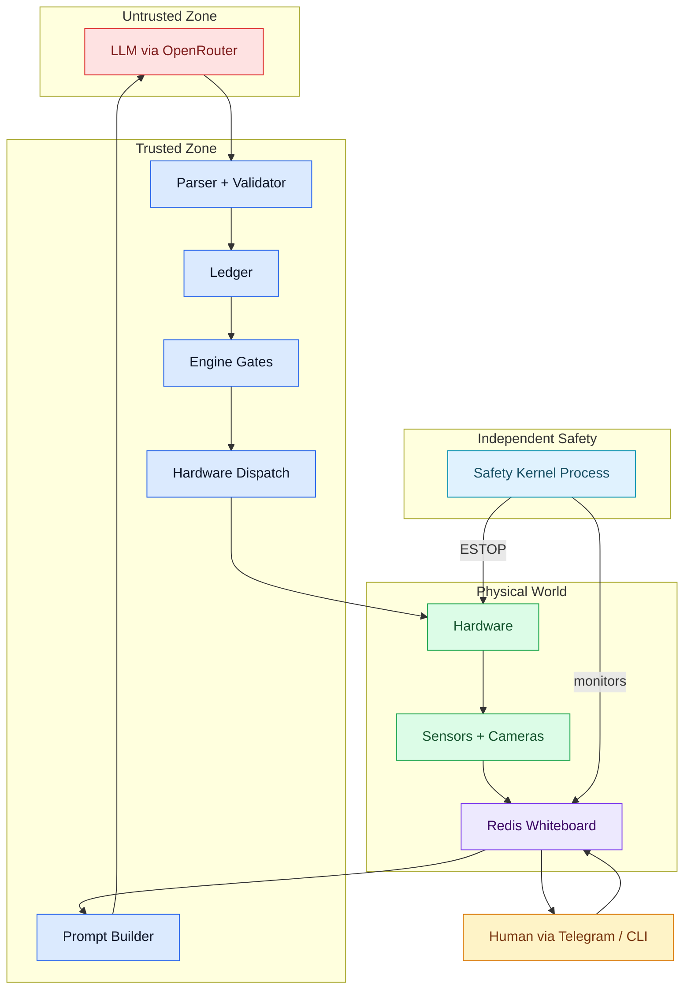

# Wallee

<p align="center">
  
</p>

[](https://github.com/anieyrudh/wallee/actions/workflows/ci.yml)


An architecture for safely letting LLMs operate physical hardware.

## Which tree do I want?

This repository currently carries two implementations:

| Tree | Status | Model | Start here |
|---|---|---|---|
| [`wallee_v6/`](wallee_v6/) | **Latest maintained (v6.5)** — active printer-control work | Compile → frontier → Plan IR planner pipeline, sim packs, Prusa CORE One/+ reference pack | [v6.5 README](wallee_v6/README.md) |
| [`wallee/`](wallee/) | Earlier generic architecture line | One-action-per-cycle agent loop, Redis whiteboard, SQLite ledger, engine gates, Telegram/CLI | this README and [`ARCHITECTURE.md`](ARCHITECTURE.md) |

Note: the v6 architecture document (`wallee_v6/docs/ARCHITECTURE.md`) and the
v6.5 experiment retrospective have not yet been committed to this repository;
[`wallee_v6/README.md`](wallee_v6/README.md) is the current v6 entry point.

**Everything below this section describes the earlier `wallee/` line**, except
where marked otherwise.

## The problem

LLMs can reason about physical systems — diagnose faults from sensor data,
plan interventions, explain what they're doing to a human operator. But they
hallucinate, they're inconsistent, and they can't be trusted with direct
hardware access.

The question isn't whether LLMs are useful for physical control.
It's how to let them reason without letting them touch.

## The approach

Let the LLM reason. Don't let it execute.

Wallee separates reasoning from execution. An LLM observes sensor data and
proposes what to do next as structured JSON. Deterministic code validates
every proposal before it reaches hardware. A safety kernel watches
independently as a separate OS process. If the agent crashes, safety
keeps running.

No prompt engineering is responsible for safety. The architecture is.

The repository ships a concrete example device pack, but the core system
itself does not assume a specific machine type. The agent loop, engine,
safety kernel, whiteboard, and ledger are designed to stay generic while
device packs define how to sense and control a particular hardware target.

## Architecture diagram



The LLM proposes actions. The engine validates every proposal against safety constraints before dispatching to hardware. The safety kernel runs as an independent process and can ESTOP the machine even if the agent crashes.

## Everything is an API

To the agent, the world is a set of APIs:

**Hardware API** — sensors publish state to the whiteboard, actuators accept
commands through the engine. `set_parameter(target=210, channel="primary")`
is an API call. The engine validates it before dispatch, exactly like an API
gateway validates requests before forwarding to a backend.

**Human API** — the operator is a service endpoint. `call_human("I need you
to clear the obstruction from the tool head", severity="warning")` is an API call with
high latency and physical capabilities the hardware API lacks. It goes through
the same engine, gets logged in the same ledger, returns a result.

**Knowledge API** — `lookup_issue("overcurrent")` queries a local reference.
`web_search("stepper driver thermal fault symptoms")` queries the internet.
`remember("This machine drifts after a long thermal soak")` writes to persistent memory. All are
tools with params and responses.

The agent doesn't know the difference between calling hardware, calling a human,
or calling a knowledge service. They're all tools. The engine knows the difference
— hardware tools go through safety gates, human and knowledge tools bypass them.

## Actuators vs sensors

The tool registry has two kinds of entries:

**Actuator tools** — actions the LLM can propose. These go through the engine
gate pipeline before executing. Examples: `set_temperature`, `pause_print`,
`call_human`.

**Sensor publishers** — background functions that periodically read hardware and
publish state to the whiteboard. The LLM never calls these directly — it reads
their output from the whiteboard. Examples: temperature readings, camera frames,
and stateful machine telemetry.

The LLM sees sensor data in its prompt. It proposes actuator tools in its response.
The engine validates actuator proposals. Sensors run independently.

Wallee currently exposes 20 actuator tools the LLM can propose, plus 20 background sensor publishers.

Device packs are where the hardware-specific work lives: sensor publishers, actuator tools, callbacks, setup instructions, and machine-specific state conventions.

## Key design principles

- Untrusted LLM: the model proposes actions, but deterministic code validates and dispatches them.
- One action per cycle: observe, reason, act, then observe again.
- Structural safety: gates, ledgers, approvals, and watchdogs carry the safety burden, not prompt wording.
- Generic core: hardware-specific behavior belongs in device packs, not in the agent, engine, or safety kernel.
- Whiteboard-first state: tools publish live state into Redis so the agent reasons from a shared world model.

## Components

- `wallee/agent/` builds prompts, calls OpenRouter, parses strict JSON, and routes one decision per cycle.
- `wallee/engine/` polls the ledger and runs proposals through a 6-stage validation pipeline before dispatch.
- `wallee/safety/` runs an independent watchdog process that monitors heartbeats, overcurrent flags, and ESTOP state.
- `wallee/device_packs/` contains hardware-facing sensors, actuators, and callbacks for concrete machine integrations.
- `wallee/human/` provides Telegram and CLI control paths, approvals, image upload, and durable operator callouts.
- `wallee/knowledge/` holds the core reasoning files plus the runtime knowledge files the agent reads while a job is active.
- `wallee/ui/` serves a read-only real-time dashboard over HTTP and WebSocket.
- `wallee/testing/` contains the offline replay harness and 60 scenario files used for regression-style decision checks.

## Repository layout

- `wallee_v6/` - latest maintained implementation, currently v6.5
- `wallee/` - earlier generic architecture/runtime line
- `ARCHITECTURE.md` - legacy root architecture reference

- [`README.md`](README.md): public overview, quick start, validation summary, and example deployment pointer.
- [`ARCHITECTURE.md`](ARCHITECTURE.md): deeper data flow, trust boundaries, runtime contracts, and validation notes.
- [`wallee/device_packs/DEVICE_PACK_GUIDE.md`](wallee/device_packs/DEVICE_PACK_GUIDE.md): how to build a new hardware integration.
- [`wallee/device_packs/AGENT_PROMPT.md`](wallee/device_packs/AGENT_PROMPT.md): prompt scaffold for AI agents creating a new device pack.
- [`wallee/device_packs/prusa_link/README.md`](wallee/device_packs/prusa_link/README.md): example device-pack documentation for the shipped reference implementation.

## The agent cycle

1. Read the full whiteboard snapshot with inline trend annotations from Redis.
2. Update phase-transition bookkeeping and fetch the current episode from the ledger.
3. Scan recent rejections to set or refresh any per-tool cooldown.
4. Read human inputs, including `human.intent`, `human.image`, and pending feedback state.
5. Auto-handle a small set of deterministic cases, such as queued work start when the machine is idle and ready.
6. Detect external state changes by comparing the whiteboard against recent tool state effects and ledger history.
7. Load the cached knowledge set for this job: `SOUL.md`, `LEARNED.md`, `OBSERVATIONS.md`, and `JOB_CONTEXT.md` when present.
8. Build the cached system prompt and the dynamic user message, then attach a human-sent photo if one exists for this cycle.
9. Snapshot stale-decision sentinels, call the LLM, and discard the answer if the world changed underneath the call.
10. Parse and validate the JSON response, apply cooldown and oscillation guards, and route the decision to the ledger or to a wait state.
11. Clear one-shot human inputs after use and go back to sleep until the next timer or wake event.

## Engine gates

The engine treats built-in non-hardware tools such as `call_human`, `lookup_issue`, and `web_search` as `gate_bypass` actions. Everything else goes through the full validation path below.

| Gate | What it checks | Failure outcome |
|---|---|---|
| Chain predecessor | Unknown tools are rejected, and later `ACTION_CHAIN` steps wait until earlier steps succeed. | `REJECTED` or `SKIPPED` |
| Safety interlock | `safety.estop` blocks all hardware actions, and resume-style actions are blocked while `agent.external_pause` is set. | `REJECTED` |
| Queue guard | Only one in-flight action per device group is allowed. | `SKIPPED` |
| Deadline | Proposal age must stay within `max_proposal_age_ms`. | `REJECTED` |
| Approval | Tools marked `requires_approval` wait for an operator decision in the ledger. | `WAITING_APPROVAL`, then `REJECTED` on timeout or rejection |
| TOCTOU precheck | The tool's side-effect-free precheck revalidates discrete state immediately before dispatch. | `REJECTED` |

After those gates, the engine writes an in-flight diary record, marks the action `DISPATCHED`, executes the tool, and persists either `DONE` or `FAILED`.

## Knowledge architecture

- `SOUL.md`: mission, values, and reasoning style. Roughly 467 words, about 607 tokens by a simple `words × 1.3` estimate.
- `LEARNED.md`: compact operating heuristics and cross-signal reasoning patterns. Roughly 560 words, about 728 tokens.
- `REFERENCE.md`: the large intervention matrix, accessed through `lookup_issue` instead of being loaded every cycle. Roughly 10,195 words, about 13.3k tokens.
- `OBSERVATIONS.md`: the live memory file, updated over time through the `remember` tool and always loaded into the system prompt.

## Quick start

1. Clone the repository and create a virtual environment.

   ```bash
   git clone https://github.com/anieyrudh/wallee.git
   cd wallee
   python3 -m venv .venv
   source .venv/bin/activate
   pip install -r requirements.txt
   ```

2. Install and start a Redis server (the whiteboard and safety monitoring
   depend on it), e.g. `sudo apt install redis-server` on a Pi.

3. Create your local config from the template.

   ```bash
   cp .env.example .env
   ```

4. Fill in the required values in `.env`, especially the OpenRouter key, Redis URL, the device pack list you want active, and any pack-specific connection settings.
5. Configure your selected device pack so its telemetry sources, control interfaces, and optional cameras are reachable from the host running Wallee.
6. Start Wallee.

   ```bash
   python -m wallee.main
   ```

   `wallee.main` launches the safety kernel subprocess automatically, then starts the engine, sensors, agent, dashboard, and optional Telegram bot.

7. Open the dashboard in a browser at `http://127.0.0.1:8081` (loopback by default; set `DASHBOARD_HOST` and `DASHBOARD_TOKEN` to expose it).

## Validation

The current suite intentionally mixes two layers of coverage:

- Core/framework tests in `tests/` validate the hardware-agnostic agent, engine, parser, whiteboard, ledger, safety kernel, and built-in tools.
- Shipped example device-pack tests under `wallee/device_packs/*/tests/` validate the concrete hardware integrations bundled with this repository.

| Run | Result |
|---|---|
| This tree (`pytest tests/ wallee/`) | `549 passed` |
| `wallee_v6` tree (`pytest wallee_v6/tests/`, run separately) | `269 passed` |
| Registered runtime actions | 20 actuator tools the LLM can propose, plus 20 background sensor publishers |
| Replay harness corpus | `60` scenarios (offline replay score: 47/60 — see `wallee/testing/REPORT.md`) |

## Known limitations

- ESTOP is software-only today. It sends a stop request through the active control path; it is not a hardware relay or power interlock.
- The safety kernel depends on Redis and network reachability to the machine, so it is independent from the agent process but not from the broader host stack.
- Vision latency is bounded by camera refresh and a multimodal OpenRouter call, so visual reaction time is slower than direct telemetry.
- The current deployment profile is single-machine oriented.

## Thesis

The contribution is not "an LLM controls hardware directly." It is: LLMs can
reason usefully about physical systems if you build an architecture that
doesn't trust them. Separate the reasoning (flexible, probabilistic,
sometimes wrong) from the execution (deterministic, validated, safe).
Let the model think. Let the code decide.

## Research / Thesis / Citation

This repository is intended to stand as a research artifact for a hardware-agnostic control architecture: the contribution is the separation between probabilistic reasoning and deterministic execution, not a claim that one specific machine integration is the architecture.

Plain citation format:

`Anieyrudh R. Wallee: An architecture for safely letting LLMs operate physical hardware. GitHub repository. 2026.`

BibTeX template:

```bibtex
@misc{wallee2026,
  author       = {Anieyrudh R},
  title        = {Wallee: An architecture for safely letting LLMs operate physical hardware},
  year         = {2026},
  howpublished = {\url{https://github.com/anieyrudh/wallee}},
  note         = {GitHub repository}
}
```

## Example implementation: Prusa Core One+ 3D printer

The repository ships one concrete deployment for a Raspberry Pi 5 controlling a
single Prusa Core One+ through device packs. It is an example implementation of
the architecture, not the architecture itself.

Hardware-specific detail for the example lives in the device-pack docs:

- Setup guide: [`wallee/device_packs/prusa_link/SETUP.md`](wallee/device_packs/prusa_link/SETUP.md)
- Capability map: [`wallee/device_packs/prusa_link/CAPABILITIES.md`](wallee/device_packs/prusa_link/CAPABILITIES.md)
- Device-pack guide: [`wallee/device_packs/DEVICE_PACK_GUIDE.md`](wallee/device_packs/DEVICE_PACK_GUIDE.md)
