# Wallee

<p align="center">
  
</p>

[](https://github.com/anieyrudh/wallee/actions/workflows/ci.yml)


**An architecture for safely letting LLMs operate physical hardware.**

Wallee drives a real 3D printer (a Prusa CORE One/+, from a Raspberry Pi 5)
with an LLM in the loop — and never trusts the LLM. The model reasons about
the live state of the machine and proposes what to do next; deterministic
code decides whether that is allowed, executes it, verifies it happened, and
can stop the machine at any moment even if the whole control process dies.

## The problem

LLMs are genuinely useful in front of physical systems: they diagnose faults
from telemetry, plan interventions, and explain themselves to an operator.
They also hallucinate and drift. The question isn't whether to use them for
physical control — it's how to let them **reason without letting them
touch**.

## The approach

Wallee's answer is structural, not prompt-based:

- **Closed action space.** Each cycle, deterministic code compiles the live
  world into a small `WorldPacket` with a **frontier**: the complete list of
  actions that are legal right now, each bounded, typed, and hazard-classed.
  The planner must answer in strict JSON (`PlanIR`) choosing frontier ids
  only. There is no free-form command channel — a hostile or hallucinated
  plan has nothing to grab.
- **Deterministic gates.** The engine re-validates every choice against a
  fresh world, takes locks, parks hazardous actions behind human approval
  (bound to exact arguments, with expiry), journals a durable `IN_FLIGHT`
  barrier *before* any side effect, and verifies the expected outcome
  afterward — demanding a replan when the world disagrees.
- **Independent safety.** A safety kernel owns a durable emergency-stop
  latch that only a human can clear, and a separate watchdog process stops
  the machine on a stale heartbeat — proven in CI by SIGKILLing the runtime
  mid-job. No prompt is ever the last line of defense.
- **Device packs.** All hardware knowledge lives in per-device packs behind
  a generic core, enforced by a ratchet that only tightens. Swap the
  machine, keep the architecture.

The six safety promises this adds up to are **executable**: each one is
pinned by named tests and CI checks that go red if it weakens. See the
promise-to-check map in [`AGENTS.md`](AGENTS.md) and the evidence in
[`docs/VALIDATION.md`](docs/VALIDATION.md).

## How a cycle works

```mermaid
%%{init: {'theme':'base','themeVariables': {
  'primaryColor':'#dbeafe','primaryTextColor':'#0f172a','primaryBorderColor':'#2563eb',
  'lineColor':'#475569','fontSize':'14px'
}}%%
flowchart LR
    HW["Hardware"] --> PACK["Device pack"]
    PACK -->|"facts"| WC["World compiler"]
    WC -->|"WorldPacket:\nfacts + legal frontier"| LLM["Planner LLM\n(untrusted)"]
    LLM -->|"PlanIR\n(strict JSON, frontier ids only)"| ENG["Engine gates:\nvalidate · approve · journal"]
    ENG -->|"bounded commands"| PACK2["Device pack"]
    PACK2 --> HW2["Hardware"]
    HW2 -->|"fresh state"| VER["Verify or replan"]
    SAFE["Safety kernel + watchdog\n(independent processes)"] -.->|"ESTOP"| HW2
    HUMAN["Human"] -.->|"approve · ESTOP · clear"| ENG

    classDef untrusted fill:#fee2e2,stroke:#dc2626,color:#7f1d1d
    classDef trusted fill:#dbeafe,stroke:#2563eb,color:#0f172a
    classDef hardware fill:#dcfce7,stroke:#16a34a,color:#14532d
    classDef safety fill:#e0f2fe,stroke:#0891b2,color:#164e63
    classDef human fill:#fef3c7,stroke:#d97706,color:#78350f
    class LLM untrusted
    class WC,ENG,VER trusted
    class HW,HW2,PACK,PACK2 hardware
    class SAFE safety
    class HUMAN human
```



## Quick start

```bash
git clone https://github.com/anieyrudh/wallee && cd wallee
python -m venv .venv && source .venv/bin/activate
pip install -e ".[dev]"

# One full cycle against the simulated printer — no hardware, no API key
# (the deterministic heuristic planner is the default backend):
python -m wallee.main --simulate --once --goal "Unload cooled part from printer_1 into tray_A"

# A short multi-cycle run:
python -m wallee.main --simulate --cycles 5 --goal "Improve the active print conservatively."

# Everything CI runs:
./scripts/gate.sh
```

To use a real LLM planner:

```bash
export WALLEE_PLANNER_BACKEND=openrouter
export OPENROUTER_API_KEY=...            # never committed; see .env.example
export OPENROUTER_MODEL=openai/gpt-5-mini
python -m wallee.main --simulate --once --goal "Improve the active print conservatively."
```

For real hardware, follow the attended cutover runbook in
[`docs/DEPLOYMENT.md`](docs/DEPLOYMENT.md) — including the safety checklist
you run with a hand on the physical emergency stop.

## The reference hardware pack

`wallee/packs/prusa_core_one_plus/` folds one physical printer's several
vendor surfaces into one device: PrusaLink HTTP as the authoritative
control path, UDP metrics as advisory telemetry, optional serial for
bounded live-tuning writes, a read-only G-code **job notebook** that gives
the planner grounded per-section context, and an observe-only nozzle-camera
vision advisory whose free text can never steer a deterministic gate. The
planner sees outcome-level actions (pause, cancel, bounded parameter trims)
— never raw G-code, never numeric setpoints, never motion.

Pack docs: [`README`](wallee/packs/prusa_core_one_plus/README.md) ·
[`SETUP`](wallee/packs/prusa_core_one_plus/SETUP.md) ·
[`CAPABILITIES`](wallee/packs/prusa_core_one_plus/CAPABILITIES.md)

## Validation, honestly

| Lane | What it proves |
|---|---|
| 422 tests (incl. entrypoint e2e) | the wired system, not just units |
| 37 contract invariants | the six safety promises, MANIFEST-pinned |
| Golden traces | refactors change nothing (byte-identical) |
| Cassette replay | the real outbound prompt/payload, offline |
| 60-scenario hazard corpus | translated legacy scenarios die at the gates |
| Fault-injection trajectories | crashes and lies degrade safely |
| Seeded-violation drill | every named guard actually fires (7/7) |

Full detail — including the honest 47/60 live-model baseline and what still
requires a hardware sign-off — in [`docs/VALIDATION.md`](docs/VALIDATION.md).

## Repository layout

```
wallee/            the runtime package (core is device-generic)
wallee/packs/      device packs: sim_printer, sim_arm, prusa_core_one_plus
tests/             suite: contract/ (promises), replay/, sim_evals/, goldens
schemas/           generated JSON schemas (PlanIR, WorldPacket, manifests)
knowledge/         planner prompt contract, rubric, examples
deploy/systemd/    the two services (runtime + independent watchdog)
scripts/           gate.sh + the checkers CI runs
docs/              DEPLOYMENT, VALIDATION, GLOSSARY, SCHEMAS, ROADMAP, history
```

## Documentation

- [`ARCHITECTURE.md`](ARCHITECTURE.md) — the full design: cycle, boundaries, durable state, safety plane
- [`AGENTS.md`](AGENTS.md) — the authoritative guide for contributors and AI agents (non-negotiables, hard rules, the gate)
- [`SECURITY.md`](SECURITY.md) — threat model and disclosure policy
- [`docs/DEPLOYMENT.md`](docs/DEPLOYMENT.md) — Raspberry Pi cutover runbook
- [`docs/VALIDATION.md`](docs/VALIDATION.md) — what is proven, by what, and what isn't yet
- [`docs/GLOSSARY.md`](docs/GLOSSARY.md) — every term of art in one place
- [`docs/SCHEMAS.md`](docs/SCHEMAS.md) — the durable JSON contracts
- [`docs/ROADMAP.md`](docs/ROADMAP.md) — deferred work, recorded deliberately
- [`CHANGELOG.md`](CHANGELOG.md) — the refactor, phase by phase

The retired v5 line is archived on the `legacy/v5` branch; its architecture
document and findings register live under
[`docs/history/`](docs/history/ARCHITECTURE_v5_legacy.md) and
[`docs/internal/RETIRED_FINDINGS.md`](docs/internal/RETIRED_FINDINGS.md).

## Known limitations

- ESTOP is software-mediated unless you add a hardware relay. The remote
  `wallee-operator estop` is a soft stop honored at the cycle boundary; the
  physical button and the watchdog are the hard paths.
- The operator notification channel (Telegram port) is not yet rebuilt for
  v6 — until it lands, unattended operation is out of bounds
  ([`SECURITY.md`](SECURITY.md)).
- The vision advisory's finding vocabulary is small (residue, stringing,
  spaghetti, blob, unknown); structural detection of detachment/collision
  is roadmap work.
- Run Wallee and the printer on a trusted, isolated network segment.

## License

MIT — see [`LICENSE`](LICENSE).
