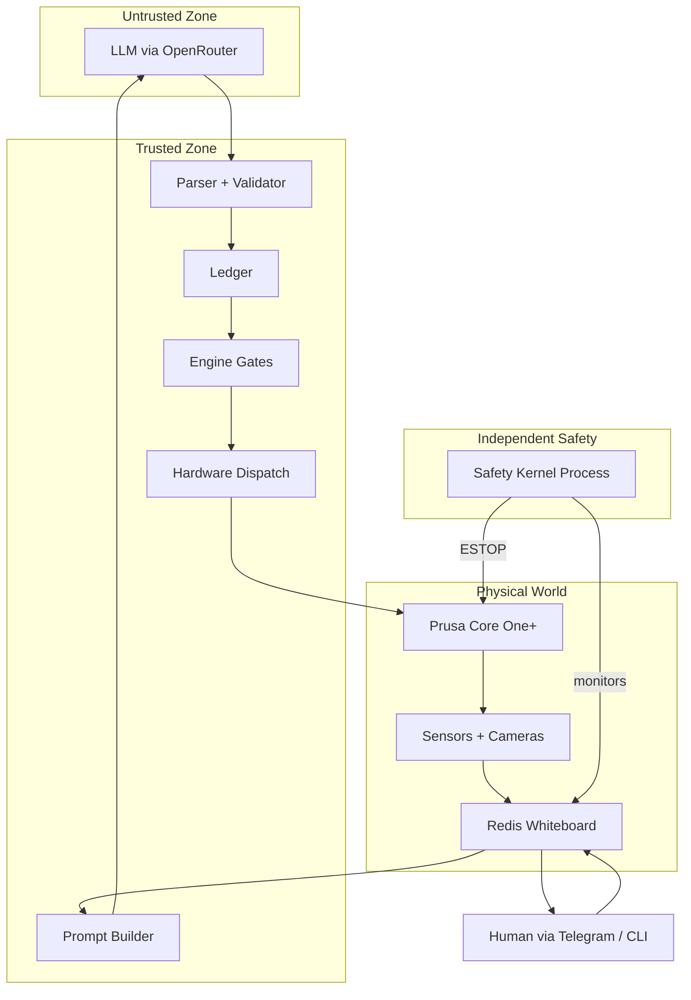

# Wallee


An architecture for safely letting LLMs operate physical hardware.

## The problem

LLMs can reason about physical systems — diagnose faults from sensor data,
plan interventions, explain what they're doing to a human operator. But they
hallucinate, they're inconsistent, and they can't be trusted with direct
hardware access.

The question isn't whether LLMs are useful for physical control.
It's how to let them reason without letting them touch.

## The approach

Let the LLM reason. Don't let it execute.

Wallee separates reasoning from execution. An LLM observes sensor data and
proposes what to do next as structured JSON. Deterministic code validates
every proposal before it reaches hardware. A safety kernel watches
independently as a separate OS process. If the agent crashes, safety
keeps running.

No prompt engineering is responsible for safety. The architecture is.

The current implementation operates a Prusa Core One+ 3D printer on a
Raspberry Pi 5, but the core — agent loop, engine, safety kernel, whiteboard,
ledger — contains zero hardware-specific logic. Printer knowledge lives
entirely in swappable device packs.

## Architecture diagram



The LLM proposes actions. The engine validates every proposal against safety constraints before dispatching to hardware. The safety kernel runs as an independent process and can ESTOP the printer even if the agent crashes.

## Everything is an API

To the agent, the world is a set of APIs:

**Hardware API** — sensors publish state to the whiteboard, actuators accept
commands through the engine. `set_temperature(target=210, heater="nozzle")`
is an API call. The engine validates it before dispatch, exactly like an API
gateway validates requests before forwarding to a backend.

**Human API** — the operator is a service endpoint. `call_human("I need you
to remove the blob from my nozzle", severity="warning")` is an API call with
high latency and physical capabilities the hardware API lacks. It goes through
the same engine, gets logged in the same ledger, returns a result.

**Knowledge API** — `lookup_issue("stringing")` queries a local reference.
`web_search("PETG moisture symptoms")` queries the internet. `remember("PLA
strings above 212°C on this printer")` writes to persistent memory. All are
tools with params and responses.

The agent doesn't know the difference between calling hardware, calling a human,
or calling a knowledge service. They're all tools. The engine knows the difference
— hardware tools go through safety gates, human and knowledge tools bypass them.

## Components

- `wallee/agent/` builds prompts, calls OpenRouter, parses strict JSON, and routes one decision per cycle.
- `wallee/engine/` polls the ledger and runs proposals through a 6-stage validation pipeline before dispatch.
- `wallee/safety/` runs an independent watchdog process that monitors heartbeats, overcurrent flags, and ESTOP state.
- `wallee/device_packs/` contains hardware-facing sensors and actuators for `host_pi`, `prusa_link`, `prusa_metrics`, `prusa_serial`, and `pi_cameras`.
- `wallee/human/` provides Telegram and CLI control paths, approvals, image upload, and durable operator callouts.
- `wallee/knowledge/` holds `SOUL.md`, `LEARNED.md`, `REFERENCE.md`, `BOOTSTRAP_OBSERVATIONS.md`, and the live observation files used by the agent.
- `wallee/ui/` serves a read-only real-time dashboard over HTTP and WebSocket.
- `wallee/testing/` contains the offline replay harness and 60 scenario files used for regression-style decision checks.

## The agent cycle

1. Read the full whiteboard snapshot with inline trend annotations from Redis.
2. Update phase-transition bookkeeping and fetch the current episode from the ledger.
3. Scan recent rejections to set or refresh any per-tool cooldown.
4. Read human inputs, including `human.intent`, `human.image`, and pending feedback state.
5. Auto-handle a small set of deterministic cases, such as queued print start when the machine is idle and cool.
6. Detect external state changes by comparing the whiteboard against recent tool state effects and ledger history.
7. Load the cached knowledge set for this job: `SOUL.md`, `LEARNED.md`, `OBSERVATIONS.md`, and `JOB_CONTEXT.md` when present.
8. Build the cached system prompt and the dynamic user message, then attach a human-sent photo if one exists for this cycle.
9. Snapshot stale-decision sentinels, call the LLM, and discard the answer if the world changed underneath the call.
10. Parse and validate the JSON response, apply cooldown and oscillation guards, and route the decision to the ledger or to a wait state.
11. Clear one-shot human inputs after use and go back to sleep until the next timer or wake event.

## Engine gates

The engine treats built-in non-hardware tools such as `call_human`, `lookup_issue`, and `web_search` as `gate_bypass` actions. Everything else goes through the full validation path below.

| Gate | What it checks | Failure outcome |
|---|---|---|
| Chain predecessor | Unknown tools are rejected, and later `ACTION_CHAIN` steps wait until earlier steps succeed. | `REJECTED` or `SKIPPED` |
| Safety interlock | `safety.estop` blocks all hardware actions, and `resume_print` is blocked while `agent.external_pause` is set. | `REJECTED` |
| Queue guard | Only one in-flight action per device group is allowed. | `SKIPPED` |
| Deadline | Proposal age must stay within `max_proposal_age_ms`. | `REJECTED` |
| Approval | Tools marked `requires_approval` wait for an operator decision in the ledger. | `WAITING_APPROVAL`, then `REJECTED` on timeout or rejection |
| TOCTOU precheck | The tool's side-effect-free precheck revalidates discrete state immediately before dispatch. | `REJECTED` |

After those gates, the engine writes an in-flight diary record, marks the action `DISPATCHED`, executes the tool, and persists either `DONE` or `FAILED`.

## Knowledge architecture

- `SOUL.md`: mission, values, and reasoning style. Roughly 467 words, about 607 tokens by a simple `words × 1.3` estimate.
- `LEARNED.md`: compact operating heuristics and cross-signal reasoning patterns. Roughly 560 words, about 728 tokens.
- `REFERENCE.md`: the large intervention matrix, accessed through `lookup_issue` instead of being loaded every cycle. Roughly 10,195 words, about 13.3k tokens.
- `OBSERVATIONS.md`: the live memory file, updated over time through the `remember` tool and always loaded into the system prompt.

## Hardware setup

- Host: Raspberry Pi 5 running Raspberry Pi OS Bookworm with Redis and Python 3.11+.
- Printer: Prusa Core One+ reachable through the local PrusaLink HTTP API.
- Metrics: configure the printer to push telemetry to the Pi on UDP port `8514` from the printer's Network metrics/logging settings.
- Nozzle camera: local `ustreamer` snapshot endpoint on `localhost`, with port auto-discovery preferring `8083`.
- Buddy cameras: Prusa WiFi cameras on the same LAN, discovered by MAC prefix and captured over RTSP.
- Optional operator path: Telegram bot token, chat ID, and allowed user IDs for approvals, alerts, and photo upload.

## Quick start

1. Clone the repository and create a virtual environment.

   ```bash
   git clone <repo-url>
   cd Wallee2
   python3 -m venv .venv
   source .venv/bin/activate
   pip install -r requirements.txt
   ```

2. Create your local config from the template.

   ```bash
   cp .env.example .env
   ```

3. Fill in the required values in `.env`, especially the OpenRouter key, Redis URL, PrusaLink host and API key, and the `DEVICE_PACKS` list you want active.
4. On the printer, enable the metrics stream so UDP telemetry reaches the Pi on port `8514`.
5. Start the camera services you want available: `ustreamer` for the nozzle camera and any Prusa buddy cameras on the LAN.
6. Start Wallee.

   ```bash
   python -m wallee.main
   ```

   `wallee.main` launches the safety kernel subprocess automatically, then starts the engine, sensors, agent, dashboard, and optional Telegram bot.

7. Open the dashboard in a browser at `http://<pi-host>:8081`.

## Test results

| Run | Result |
|---|---|
| Architecture verification snapshot | `523 passed in 36.56s` |
| Current repository after cleanup and documentation work | `518 passed in 36.45s` |
| Registered runtime tools | `39 total` (`19` sensors, `20` actuators) |
| Replay harness corpus | `60` scenarios |

## Known limitations

- ESTOP is software-only today. It pauses the printer through PrusaLink; it is not a hardware relay or power interlock.
- The safety kernel depends on Redis and network reachability to the printer, so it is independent from the agent process but not from the broader host stack.
- Vision latency is bounded by camera refresh and a multimodal OpenRouter call, so visual reaction time is slower than direct telemetry.
- The current deployment is single-printer oriented and the shipped device packs target one Prusa Core One+ installation.

## Thesis

The contribution is not "an LLM controls a printer." It is: LLMs can
reason usefully about physical systems if you build an architecture that
doesn't trust them. Separate the reasoning (flexible, probabilistic,
sometimes wrong) from the execution (deterministic, validated, safe).
Let the model think. Let the code decide.
