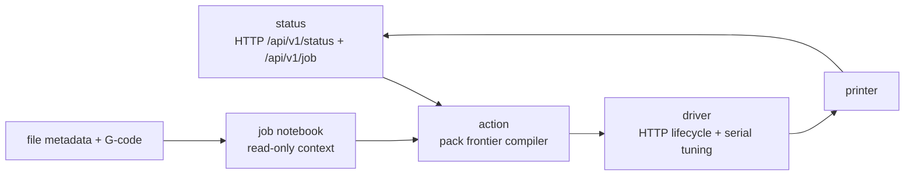
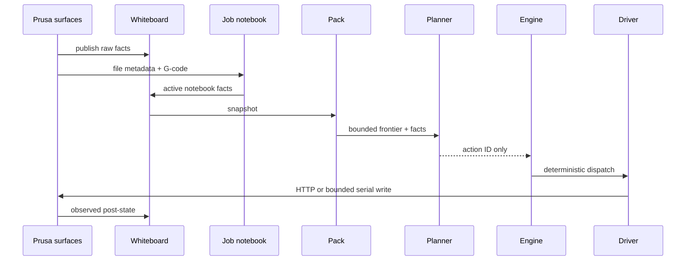
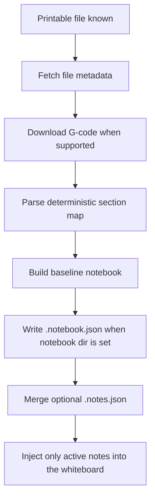
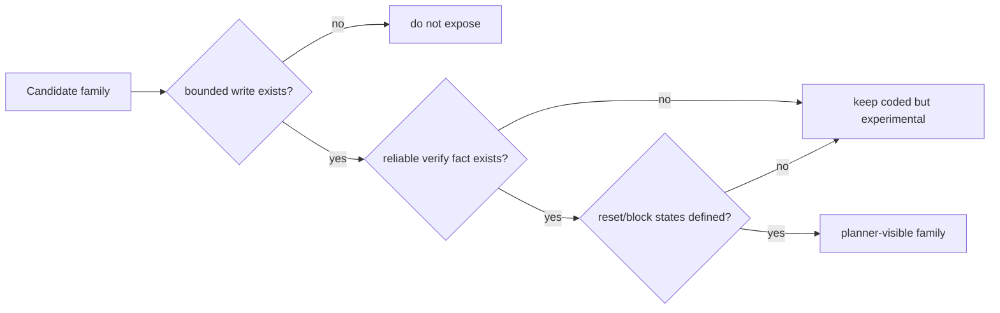
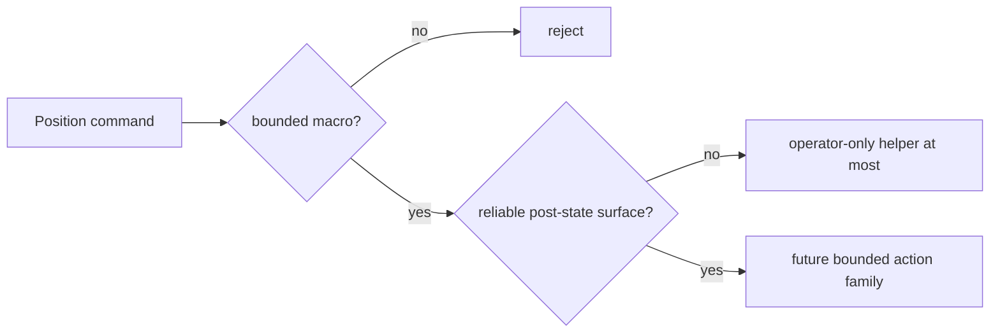
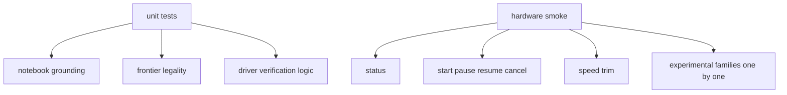

# Prusa CORE One/+ Architecture

This is the small, grounded design for the Prusa pack.

The design goal is not a giant abstraction. The goal is a clean Prusa component
that fits the Wallee core:

- frontier-only planner
- untrusted LLM
- deterministic execution and verification
- one writer path per live action family
- supported surfaces first

## 1. The four local pieces

### status

Purpose:
- read live printer truth from supported Prusa surfaces

Owns:
- current lifecycle
- current job facts
- current live tuning facts already observable from HTTP status

Must not:
- invent policy
- verify from serial readback text

### job notebook

Purpose:
- understand the print while staying grounded

Owns:
- deterministic section map
- global notes
- local notes tied to section IDs

Must not:
- write to hardware
- decide legality
- become free-form memory with no anchors

### action

Purpose:
- combine whiteboard facts and active notebook notes into bounded action IDs

Owns:
- legal candidate actions
- normalization of facts and resources

Must not:
- emit raw vendor commands to the planner
- compute hardware writes directly
- become a second transport framework

### driver

Purpose:
- perform real writes and verify post-state

Owns:
- lifecycle HTTP commands
- serial bounded tuning writes
- wait/verify loop

Must not:
- read planner prose
- depend on notebook contents
- become a second planner

## 2. Runtime flow

## Status vocabulary

- `implemented`: coded and unit-tested in this repository
- `direct-hardware-proven`: direct operator-only write observed on real
  hardware and verified through `GET /api/v1/status`
- `managed-wallee-proven`: deterministic engine dispatch observed on real
  hardware and verified through `GET /api/v1/status`, with no LLM action choice
- `planner-enabled`: admitted by config and policy in the live frontier

Managed proof does not, by itself, make a family planner-enabled.

## 3. Job notebook design

The notebook solves the old problem where print understanding leaked into the
live control path.

### Section grounding

Each section carries:

- `section_id`
- line range
- approximate progress window
- layer number
- Z height
- tags from slicer comments

That is why the pack can say “use note for `sec_0007`” instead of vague text
like “this section”.

### Global vs local notes

- **global** notes apply to the whole job
- **local** notes apply to explicit `section_id`s only

The summary injected into the planner always tries to include at least one local
note when a local note is active.

## 4. Live control families

### Current families

#### Planner-enabled families

- speed down small
  - write: serial `M220 S(current-5)` within `75..125`
  - verify: HTTP status speed = explicit target
  - reset: `M220 S100`
  - status: implemented, direct-hardware-proven, managed-wallee-proven, and
    planner-enabled
- speed up small
  - write: serial `M220 S(current+5)` within `75..125`
  - verify: HTTP status speed = explicit target
  - reset: `M220 S100`
  - status: implemented and planner-enabled
- flow down small
  - write: `M221 S(current-5)` within `75..125`
  - verify: flow readback = explicit target
  - reset: `M221 S100`
  - status: implemented, direct-hardware-proven, managed-wallee-proven, and
    planner-enabled
- flow up small
  - write: `M221 S(current+5)` within `75..125`
  - verify: flow readback = explicit target
  - reset: `M221 S100`
  - status: implemented and planner-enabled
- nozzle target up/down small
  - write: `M104 S...`
  - verify: HTTP status nozzle target changed
  - reset: paired bounded opposite action
  - status: implemented, direct-hardware-proven, managed-wallee-proven, and
    planner-enabled
- bed target up/down small
  - write: `M140 S...`
  - verify: HTTP status bed target changed
  - reset: paired bounded opposite action
  - status: implemented, direct-hardware-proven, managed-wallee-proven, and
    planner-enabled

#### Not exposed

- arbitrary `G0/G1`
- arbitrary `G27/G28`
- planner-visible raw position control

## 5. Why position stays out for now

Position is different from speed and target temperatures.
For this redesign pass we do **not** admit planner-visible position control.
The pack can grow safe position macros later if a supported verify surface and a
clear workflow need appear.

## 6. Whiteboard facts the pack publishes

Core facts:

- `printer_1.lifecycle`
- `printer_1.health`
- `printer_1.job_active`
- `printer_1.job_progress_pct`
- `printer_1.current_file`
- `printer_1.requested_file`
- `printer_1.part_present`
- `printer_1.safe_to_unload`

Live tuning facts:

- `printer_1.speed_pct`
- `printer_1.flow_pct`
- `printer_1.nozzle_temp_c`
- `printer_1.nozzle_target_c`
- `printer_1.bed_temp_c`
- `printer_1.bed_target_c`

Notebook facts:

- `printer_1.job_notebook_available`
- `printer_1.job_hash`
- `printer_1.job_material`
- `printer_1.job_layer_height_mm`
- `printer_1.job_active_section`
- `printer_1.job_active_notes`

## 7. Deletions baked into this redesign

- no FFF in the critical path
- no UDP metrics dependency
- no serial readback truth path
- no planner-visible raw numeric tuning targets
- no transport fragmentation at planner level
- no vague notebook memory with no section anchors

## 8. Main testing idea

Unit tests prove the design shape. Real-printer smokes prove supported-surface
reality.
