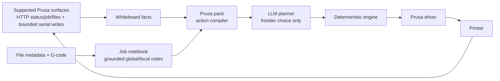

# Prusa CORE One/+ Pack

This pack models **one physical Prusa CORE One / CORE One+** as **one Wallee pack**.

It keeps the core trust boundary intact:

- the whiteboard carries live facts from supported Prusa surfaces
- the pack exposes only bounded action IDs to the planner
- the driver owns the only real write paths
- verification comes back through observed post-state
- the job notebook is read-only context, not a controller

FFF is intentionally **not** part of this redesign pass.

## What is in this pack

## Module map

- `adapters.py`
  - supported Prusa HTTP client
  - bounded serial writer
  - settings
- `driver.py`
  - lifecycle control
  - bounded live tuning writes
  - post-state verification
- `job_notebook.py`
  - deterministic job map + notebook builder
  - optional merge of external grounded notes
- `types.py`
  - small Prusa-specific data contracts
- `pack.py`
  - whiteboard publishing
  - normalization
  - frontier compilation
  - realization dispatch to the driver
- `hardware_smoke.py`
  - explicit operator/Codex smoke commands for a real printer

## What the planner sees

The planner does **not** see raw G-code or raw numeric knobs.
It sees bounded action IDs such as:

- `A_PRUSA_PAUSE`
- `A_PRUSA_RESUME`
- `A_PRUSA_CANCEL`
- `A_PRUSA_TRIM_SPEED_DOWN_SMALL`
- optional experimental tuning actions when enabled

## Current status terms

- `implemented`: coded and unit-tested in this repository
- `direct-hardware-proven`: direct operator-only write observed on real
  hardware and verified through `GET /api/v1/status`
- `managed-wallee-proven`: deterministic engine dispatch observed on real
  hardware and verified through `GET /api/v1/status`, with no LLM action choice
- `planner-enabled`: admitted by config and policy in the live frontier

## Current family status

### Implemented

- lifecycle over HTTP
- grounded notebook build from file metadata and G-code
- bounded speed trim down through serial `M220`, verified through HTTP status
- bounded flow trim down through `M221`
- bounded nozzle target up/down through `M104`
- bounded bed target up/down through `M140`

### Direct-hardware-proven

- bounded speed trim down through serial `M220`, verified through HTTP status
- bounded flow trim down through `M221`, verified through HTTP status
- bounded nozzle target up/down through `M104`, verified through HTTP status
- bounded bed target up/down through `M140`, verified through HTTP status

### Managed-wallee-proven

- bounded speed trim down through deterministic engine dispatch and HTTP status
  verification
- bounded flow trim down through deterministic engine dispatch and HTTP status
  verification
- bounded nozzle target up/down through deterministic engine dispatch and HTTP
  status verification
- bounded bed target up/down through deterministic engine dispatch and HTTP
  status verification

### Planner-enabled

- lifecycle over HTTP
- grounded notebook build from file metadata and G-code
- bounded speed trim down through serial `M220`, verified through HTTP status
- bounded flow trim down through `M221`, verified through HTTP status
- bounded nozzle target up/down through `M104`, verified through HTTP status
- bounded bed target up/down through `M140`, verified through HTTP status

All current bounded trim families are now planner-enabled.

## Limited live operation

Normal-runtime bounded observations now also exist for this pack under:

- [live_runtime/README.md](/Users/anieyrudh/Desktop/Wallee2/wallee_v6/docs/evidence/prusa_core_one_plus/live_runtime/README.md)
- [RUNBOOK.md](/Users/anieyrudh/Desktop/Wallee2/wallee_v6/docs/evidence/prusa_core_one_plus/live_runtime/RUNBOOK.md)

These are actual runtime runs through `python -m wallee_v6.main --once`,
not smoke-harness sessions. The runtime boundary stayed the same:

- frontier-only legality
- one action at a time
- deterministic verify-after-each-action
- notebook notes advisory only
- hard stop on the first ambiguity

## What is deliberately missing

- no FFF dependency
- no UDP metrics dependency
- no planner-visible arbitrary motion
- no planner-visible position control
- no planner-visible arbitrary raw temperature/flow targets
- no second controller

## The job notebook

The notebook is built automatically when the pack can identify a printable file.

It has two note scopes:

- **global notes**: whole-job facts and watchpoints
- **local notes**: anchored to parser-defined `section_id`s

Each section is grounded by:

- line range
- approximate progress window
- layer number
- Z height
- parser tags such as `bridge`, `high_flow`, `tiny_layer`

If `PRUSA_CORE_ONE_NOTEBOOK_DIR` is set, the pack writes a baseline artifact:

- `<job_hash>.notebook.json`

If an external notebook tool or human writes:

- `<job_hash>.notes.json`

then the pack merges those grounded notes on the next cycle.

## Where to read next

- [ARCHITECTURE.md](ARCHITECTURE.md)
- [CAPABILITIES.md](CAPABILITIES.md)
- [SETUP.md](SETUP.md)
- [TESTING.md](TESTING.md)
- [CODEX_HARDWARE_TESTING.md](CODEX_HARDWARE_TESTING.md)
